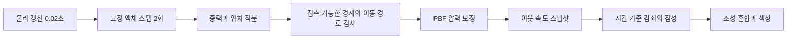

# GPU 액체 계산과 물체 이동의 분리

2026-09-21. 적용 범위: PhysicsLab 전용 런타임, 셰이더, 검증기. 기존 바텐딩 GPU 백엔드와 게임 씬은 변경하지 않는다.

## 문제와 재현

기존 `Step()`은 모든 물체의 이동/회전량 중 최댓값으로 전역 서브스텝을 늘렸다. 이 때문에 액체와 떨어진 빈 물체를 움직여도 모든 액체의 시간 간격, 압력 보정 횟수, 감쇠/점성 적용 횟수가 바뀌었다. 이전 검사는 움직인 잔의 액체량을 확인했으나 다른 잔의 입자 위치·속도는 비교하지 않았다.

실제 GPU에서 동일한 초기 상태를 반복하고 먼 물체만 이동한 실험:

| 조건 | 기존 위치 RMS 차이 | 기존 속도 RMS 차이 | 수정 후 위치/속도 차이 | 수정 후 서브스텝 |
| --- | ---: | ---: | ---: | ---: |
| 정지 A/A 반복 | 0 | 0 | 0 / 0 | 2 |
| 먼 물체 빠른 드래그 | 0.277184576 | 0.601512849 | 0 / 0 | 2 |
| 먼 물체 다회전 | 0.360767722 | 0.571906447 | 0 / 0 | 2 |

위치는 Unity 월드 단위, 속도는 월드 단위/초다. 기존 드래그/회전에서 전역 서브스텝은 각각 21/23회까지 늘었다. 이 수치는 해당 대조 fixture의 측정값이며 모든 장면·GPU의 수치적 일치나 성능을 보장하는 수치가 아니다.

## 새 계산 흐름

1. **고정 시간 적분.** 기본 액체 스텝은 0.01초다. 설정 `gpuLiquidSubsteps`는 해상도 설정으로 남지만 물체 이동이나 선택 상태로 변경하지 않는다. 최대 입력 각도를 제한하거나 우클릭 해제 시 회전을 복귀시키지 않는다.
2. **국소 이동 경로 검사.** 경계에 로컬 끝점, 시작/끝 원점, 시작 각도와 누적 회전을 전달한다. `SweepBoundaries`는 충돌 필터와 이동 범위 검사를 통과한 입자/경계 쌍만 보수적 전진 방식으로 검사한다. 선형 이동과 회전을 경로에서 평가하므로 한 스텝 사이에 벽이 입자를 통과하는 경우를 처리한다.
3. **연산 범위 분리.** 회전 경로가 길어지면 해당 쌍의 기하 검사 횟수만 늘어난다. 입자 압력 계산, 혼합, 중력 적분은 더 자주 실행하지 않는다. 국소 반복 횟수는 `128 + ceil(abs(angleDeltaRadians) * 64)`이며 최대 2048이다. 한도를 소진하면 `_Statistics[2]`에 누적하고 검사에서 실패시킨다. `_Statistics[3]`은 사용한 최대 횟수다. 이 한도는 사용자 회전 각도 제한이 아니라 검사 비용의 상한이며, 극단적 입력에 대해 무한 정밀 충돌을 보장하지 않는다.
4. **압력 보정과 이동 충돌의 분리.** 이동 경로 검사는 적분 직후 한 번 수행한다. 각 압력 반복에서는 현재 경계와의 겹침과 경계 통과를 보정하며, 물체의 전체 이동을 매번 다시 적용하지 않는다.
5. **시간 기준 계수.** 0.01초에서의 계수 `b`를 `1 - (1 - b)^(dt / 0.01)`로 환산한다. 감쇠, 점성, 벽 마찰, 스플래시 전달에 적용했다. 자유 입자의 0.4초 후 속도는 1회 분할에서 2.66028619, 4회 분할에서 2.66025662였고 허용 오차 0.001 이내였다. 압력 풀이 전체가 모든 해상도에서 동일하다는 주장은 아니다.
6. **이웃 속도 읽기 분리.** 속도 갱신 전에 별도 버퍼로 스냅샷을 만든다. 이웃 스레드가 이미 갱신했는지에 따라 점성 계산이 달라지는 동시 읽기/쓰기 경로를 제거했다.

경계 버퍼의 C#/HLSL 구조를 함께 변경했다. 열려 있는 Unity에서는 스크립트 재컴파일 후 Play Mode를 다시 시작해야 새 버퍼로 초기화된다. 프리팹이나 씬을 재생성할 필요는 없다.

## 검증 범위와 실행 기록

- `09-coupling-baseline-direct-callback`: 원본 20826b0 코드로 결함 재현, 종료 1. 정지 반복은 일치했고 먼 물체의 이동만으로 액체 위치/속도가 달라졌다.
- `10-local-contact-redesign`: 원거리 차이는 0이었지만 다회전 접촉에서 국소 한도 초과, 종료 1. 성공으로 취급하지 않았다.
- `14-final-isolation-and-damping`: 실제 RTX 3070/Direct3D11 GPU 검사 10개 통과, 종료 0. 원거리 열린/닫힌 잔 비교, 접촉한 입자 밀기, 빠른 이동과 855도 회전, 액체 보존·쏟아짐, 국소 검사 한도, 시간 기준 감쇠를 확인했다.
- `13-final-authored-scene`: 실제 씬과 프리팹을 복사한 환경에서 38개 검사 통과, 종료 0. 집기·투척·충돌·스왑·쏟아짐·초기화와 1024개 입자 검사, GPU 화면 캡처를 포함한다. 기존 시스템 존재 여부 2개는 복사 환경에서 판단할 수 없어 SKIP으로 남겼다.
- 원본 `Assembly-CSharp-Editor.csproj` 전체 빌드: 메타데이터 복원 후 오류 0개. 앞선 SDK 접근 거부와 복원 파일 누락 실패 로그는 따로 보존했다.

단순 GPU 대조 프로젝트에서는 액체에 필요한 필드만 있는 ItemDef 대체 데이터를 사용한다. 실제 씬 복사 프로젝트에서는 원본 ItemDef 소스와 에셋을 사용한다. 현재 사용자가 연 Unity의 씬, 플레이 상태, 미저장 작업은 테스트 도구가 닫거나 저장하지 않는다. 사람의 마우스 조작감 및 실제 게임 씬 통합은 별도 검증 범위다.

재현 스크립트는 저장소 루트 `PhysicsLabEvidence/HarnessSource/`에 있다. `Prepare-Harness.ps1` 후 `Run-Unity.ps1`에 `IsolationHarness.Begin`과 `HarnessProject` 경로를 전달하면 대조 검사를 실행한다. 실제 씬은 `prepare_scene_harness.py`로 복사하고 `PhysicsLabValidator.Begin`과 `SceneHarnessProject` 경로를 전달한다. 실행 폴더 이름은 매번 새로 지정해야 한다.
