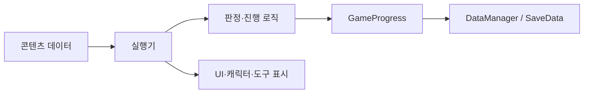

# Slainte 아키텍처

기준일: 2026-09-02

## 1. 설계 요약

Slainte는 다음 네 경계로 구성된다.

1. `CoreScene`: 씬과 무관하게 유지되는 진행·저장·전환 서비스
2. `BusinessScene`: 에피소드, 영업 주문, 칵테일 제조를 공유하는 플레이 공간
3. `RestScene`: 다음 에피소드 선택, 상점, 현황 UI
4. 콘텐츠 데이터: ScriptableObject, CSV, Resources, StreamingAssets

런타임 상태의 원본은 `GameProgress`다. UI와 씬 오브젝트는 상태를 표시하거나 변경을 요청할 뿐, 독자적인 진행 원본이 되어서는 안 된다.

## 2. 객체 수명

| 기반 | 수명 | 대표 클래스 |
|---|---|---|
| `MonoSingleton<T>` | 앱 수명, `DontDestroyOnLoad` | `GameManager`, `DayFlowController`, `EpisodeManager`, `DataManager`, `GameProgress`, `AudioManager` |
| `SceneSingleton<T>` | 현재 씬 수명 | `GameModeManager`, 씬 참조를 보유한 관리자 |
| 일반 `MonoBehaviour` | 소유 씬·세션 수명 | `EpisodeRunner`, `CustomerSpawner`, 도구 Controller |
| 런타임 생성 객체 | 주문 제조 세션 수명 | 바텐딩 카메라, RenderTexture, 슬롯, 도구, 액체 풀 |

전역 서비스는 씬의 UI 오브젝트를 장기 참조하지 않는다. 씬 로컬 참조는 `BusinessFlowBootstrap`처럼 씬이 로드될 때 다시 탐색하고 연결한다.

## 3. 상태 머신

### 게임 전체

```text
None
→ Episode
→ Business
→ Rest
→ Episode ...
```

`DayFlowController`가 순서를 결정하고 `GameManager`가 상태에 맞는 씬 전환 또는 시작 콜백을 실행한다.

### BusinessScene 내부

| 모드 | 의미 |
|---|---|
| `OrderMode` | 영업 손님과 주문 대사 |
| `EpisodeMode` | 에피소드 대사·선택 |
| `CraftingMode` | 영업·에피소드 공용 제조 |

`GameModeManager`는 패널과 입력 가능 상태만 관리한다. 하루 진행과 저장을 관리하지 않는다.

### 주문 세션

```text
Idle
→ PresentingOrder
→ Crafting
→ Evaluating
→ PresentingFeedback
→ Completed
```

에피소드 주문은 주문 제시와 피드백 단계를 설정으로 생략한다. 수락·거절·포기 상태는 없다.

## 4. 의존 방향



권장 규칙:

- 데이터 에셋은 씬 오브젝트를 참조하지 않는다.
- 판정 로직은 UI 텍스트나 버튼에 의존하지 않는다.
- 저장 필드는 `GameProgress`, `SaveData`, `DataManager.Save()`, `GameProgress.LoadFrom()`을 함께 변경한다.
- 에피소드와 손님 조건은 `ProgressConditionEvaluator`를 공유한다.
- 영업과 에피소드 제조는 `BusinessOrderSessionController`를 공유한다.
- UI에 표시할 주문 대사와 내부 판정 레시피 ID를 분리한다.

## 5. 데이터 패턴

### ScriptableObject 데이터베이스

| 영역 | 단일 에셋 | 데이터베이스·로더 |
|---|---|---|
| 캐릭터 | `CharacterData` | `CharacterDatabase` |
| 주문 | `CustomerOrderData` | `CustomerOrderDatabase` |
| 방문 | `CustomerVisitData` | `CustomerVisitDatabase` |
| 주문서 | `OrderTicketData` | `OrderTicketDatabase` |
| 제조 아이템 | `ItemDef` | `ItemDefCatalog` |
| 술장 | `LiquorBottleDef` | `LiquorShelfUI` 직렬화 목록 |
| 레시피 | `CocktailRecipeDef` | `CocktailRecipeDataLoader` |
| 에피소드 | `EpisodeData` | `EpisodeManager` |

문자열 키가 시스템 간 외래 키 역할을 한다. 키 참조는 컴파일러가 보장하지 않으므로 Editor 검증을 함께 유지한다.

### 손님 방문과 주문 분리

```text
CharacterData
  └─ 스프라이트·표정·눈 깜박임

CustomerVisitData
  ├─ members[]
  ├─ 방문 조건·가중치·재등장 대기
  └─ orders[]

CustomerOrderData
  └─ 주문 대사·결과 대사·내부 레시피 ID
```

개인·커플·단체는 `members` 개수로 표현한다. 관계 유형별 런타임 분기를 만들지 않는다.

### 레시피 데이터

사람이 수정하는 원본은 `Features/Bartending/Content/Source/Planning`의 `items.csv`, `recipes.csv`, `recipe_ingredients.csv`다. 에디터 임포터가 이를 런타임 에셋으로 변환하며, `CocktailRecipeDataLoader`는 `Resources/Bartending/Recipes`의 기본 `CocktailRecipeDef` 21개를 단일 제품 런타임 소스로 읽는다. `CocktailRecipeCsvLoader`와 `StreamingAssets/Bartending`의 샘플 CSV는 개발·검증 경로다.

결과별 파생 레시피 에셋은 두지 않는다. 기본 레시피가 정확히 맞으면 `Good`, 핵심 배합·기법이 맞고 잔·얼음만 다르면 주문 평가기가 `MidGlass`/`MidIce`/`MidIceGlass`로 직접 분류한다. 다른 기본 레시피가 정확히 감지되면 `MidWrongMenu`다.

## 6. 공용 주문 경계

`OrderSessionRequest`가 호출자별 정책을 전달한다.

| 정책 | 영업 | 에피소드 |
|---|---|---|
| 손님 주문 제시 | 사용 | 생략 |
| 결과 대사 | 사용 | 생략 |
| 진행 보상 | 돈·명성 적용 | 미적용 |
| 캐릭터 정리 | 주문 종료 후 | 에피소드가 관리 |
| 완료 후 | 다음 영업 entry | 노드 분기 |

판정 입력은 `VesselLiquidTracker.BuildComposition()`이며, 화면 버튼이나 주문서 표시 데이터가 아니다.

## 7. 액체와 제조 경계

```text
ItemDef
→ BottleController
→ LiquidParticleData / LiquidPayload
→ LiquidReaction
→ VesselLiquidTracker
→ CocktailComposition
→ CocktailEvaluator
→ CocktailOrderEvaluator
```

- `LiquidPayload`: 재료별 ml, 온도, 제조법
- `LiquidParticleData`: payload와 용기 소유권, 색상 표현
- `VesselLiquidTracker`: 용기 내부 입자를 합산
- `GlassSteamEmitter`: 뜨거운 표면 입자를 시각 효과로 변환
- `LiquidPool`: 시각 입자 재사용과 화면 밖 반환

제조 물리와 판정 데이터는 연결되어 있지만 역할은 다르다. 셰이더·ParticleSystem 변경이 레시피 판정값을 직접 바꾸지 않도록 유지한다.

## 8. 이벤트 연결

주요 이벤트:

- `DialogueController.DialogueClosed`
- `GameModeManager.OnModeChanged`
- `BusinessOrderSessionController.StateChanged`
- `BusinessOrderSessionController.OrderCompleted`
- `BusinessShiftController.ShiftCompleted`
- `BusinessBartendingBootstrap.ServeRequested`
- `BottleController.CapacityChanged`

이벤트 구독 클래스는 `OnDestroy` 또는 세션 정리에서 반드시 구독을 해제한다.

## 9. 현재 병존하는 경로

| 현재 제품 경로 | 이전·별도 경로 |
|---|---|
| `EpisodeData → EpisodeRunner` | 베이크 JSON `NarrativeManager` |
| `CustomerVisitData.members` | `CustomerOrderData.characterKey` 호환 필드 |
| 공용 주문 세션 | `CraftingJudgeUI` 수동 Good/Bad |
| `LiquorShelfUI` 병 선택 | `DragandDrop/ShelfUI`, `DrawerUI` |
| 기획 CSV 임포터 | 이전 `ItemDataImporter` 상점 전용 임포터 |

리뷰 시 클래스가 존재한다는 이유만으로 현재 플레이 경로라고 판단하지 않는다. 씬·Prefab 참조와 Bootstrap 호출 체인을 함께 확인한다.

## 10. 알려진 구조적 부채

- 공용 계약에는 EditMode 테스트와 `.asmdef` 경계가 있지만, 기능 간 상호 의존 때문에 Core·Business·Bartending·Narrative·Rest 경계는 아직 단일 기본 어셈블리에 남아 있다.
- 저장이 비원자적이고 정확한 실행 위치를 저장하지 않는다.
- 제조용 `ItemDef`와 술장용 `LiquorBottleDef`는 동일 아이템 ID로 연결되지만 별도 타입이며, 이전 상점용 `ItemData` 경로도 남아 있다.
- 다수 시스템이 문자열 키와 `Resources.Load`에 의존한다.
- 일부 에피소드 제조 노드의 레시피 ID가 비어 있다.
- 휴식 상점 구매가 진행도와 연결되지 않았다.
