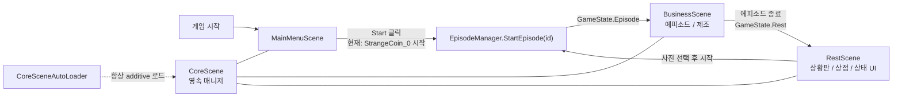
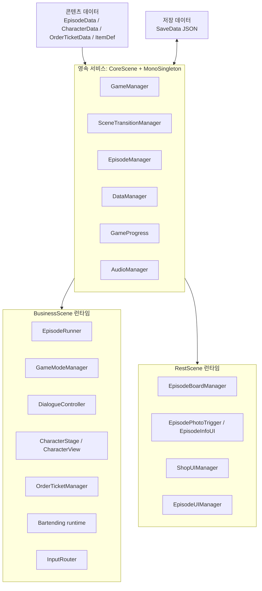
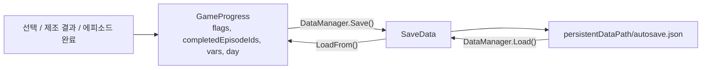
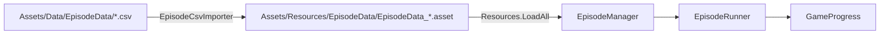
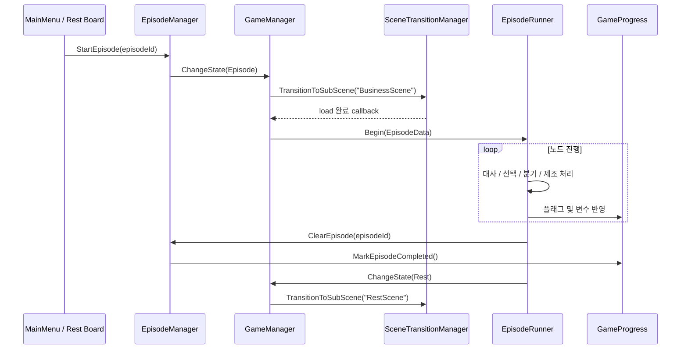
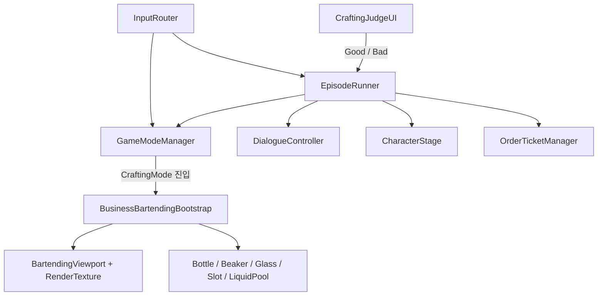
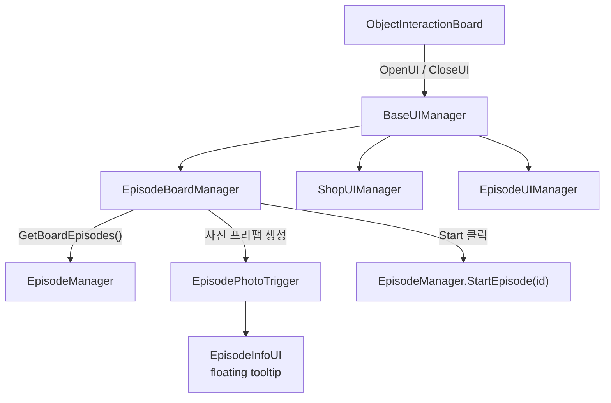

# Slainte 프로젝트 코드 지도

이 문서는 현재 프로젝트의 실행 구조를 빠르게 이해하기 위한 단일 진입점이다.  
`CoreScene`의 영속 서비스, `BusinessScene`의 에피소드/제조 진행, `RestScene`의 휴식 UI를 중심으로 실제 코드 흐름을 정리한다.

## 1. 한눈에 보는 실행 흐름

핵심은 두 종류의 상태 전환을 구분하는 것이다.

| 범위 | 상태 | 담당 코드 | 역할 |
|---|---|---|---|
| 씬 사이 | `GameState.Episode`, `GameState.Rest` | `GameManager`, `SceneTransitionManager` | `BusinessScene`과 `RestScene`을 교체 |
| BusinessScene 내부 | `OrderMode`, `EpisodeMode`, `CraftingMode` | `GameModeManager` | 대화, 주문표, 제조 판정 패널의 표시 상태 전환 |

## 2. 전체 레이어 구조

## 3. 씬 구성

Build Settings에 등록된 실제 플레이 씬은 다음 네 개다.

| 씬 | 목적 | 대표 스크립트 |
|---|---|---|
| `Assets/MainMenuScene.unity` | 새 게임 시작 진입점 | `MainMenuManager` |
| `Assets/CoreScene/CoreScene.unity` | 씬 전환 중에도 유지되는 관리자 보관 | `GameManager`, `SceneTransitionManager`, `EpisodeManager`, `DataManager`, `AudioManager` |
| `Assets/BusinessScene.unity` | 대화, 에피소드 진행, 제조 인터랙션 | `EpisodeRunner`, `GameModeManager`, `DialogueController`, `CharacterStage`, `OrderTicketManager`, `InputRouter` |
| `Assets/RestScene/RestScene.unity` | 휴식 공간, 상황판, 상점 | `EpisodeBoardManager`, `ShopUIManager`, `EpisodeUIManager` |

`CoreSceneAutoLoader`는 현재 열린 씬과 무관하게 `CoreScene`이 없으면 additive 방식으로 로드한다.  
`MonoSingleton<T>`를 상속한 객체는 `DontDestroyOnLoad`가 적용되어 서브 씬 교체 후에도 유지된다.

## 4. 영속 코어 시스템

### 주요 책임

| 클래스 | 경로 | 책임 |
|---|---|---|
| `MonoSingleton<T>` | `Assets/CoreScene/Scripts/MonoSingleton.cs` | 싱글 인스턴스 확보 및 `DontDestroyOnLoad` 처리 |
| `CoreSceneAutoLoader` | `Assets/CoreScene/Scripts/CoreSceneAutoLoader.cs` | 어느 씬에서 실행해도 `CoreScene` 자동 로드 |
| `GameManager` | `Assets/CoreScene/Scripts/GameManager.cs` | `GameState` 변경과 서브 씬 선택 |
| `SceneTransitionManager` | `Assets/CoreScene/Scripts/SceneTransitionManager.cs` | fade, 기존 서브 씬 unload, 새 서브 씬 additive load |
| `EpisodeManager` | `Assets/CoreScene/Scripts/EpisodeManager.cs` | 에피소드 검색, 시작 가능 조건 평가, 시작/완료 기록 |
| `DataManager` | `Assets/CoreScene/Scripts/DataManager.cs` | `autosave.json` 저장/로드 |
| `SaveData` | `Assets/CoreScene/Scripts/SaveData.cs` | 저장 가능한 직렬화 구조 |
| `GameProgress` | `Assets/Scripts/GameProgress.cs` | 일차, 플래그, 완료 에피소드, 정수 변수의 런타임 원본 |
| `AudioManager` | `Assets/Scripts/Audio/AudioManager.cs` | `Resources/BGM`의 BGM crossfade 재생 |

### 저장 구조

`GameProgress`에 기록되는 정수 변수는 스토리 호감도뿐 아니라 상황판 슬롯 기억값(`BoardSlot_{episodeId}`)에도 사용된다.

## 5. 에피소드 실행 파이프라인

### 데이터 경로

| 타입 | 내용 |
|---|---|
| `EpisodeData` | ID, 제목, 시작 노드, 노드 목록, 트리거 조건, 보드 표시용 필드 |
| `EpisodeNode` | 대사, 다음 노드, 선택지, 플래그/변수 분기, 제조 노드, BGM 명령 |
| `EpisodeChoice` | 선택 후 이동 노드와 `setFlags`, `clearFlags`, `varChanges` |
| `EpisodeTriggerCondition` | 최소 일차, 필수/차단 플래그, 선행 에피소드, 정수 조건 |

`EpisodeCsvImporter`는 CSV 내용을 `EpisodeData` 에셋으로 변환한다. 현재 보드 표시용 수동 필드(`episodeDescription`, `iconNameBoard`, `characters` 등)는 기존 에셋에서 보존하는 코드가 있다.

### 에피소드 한 회의 런타임 순서

### `EpisodeRunner`가 연결하는 화면 요소

| 연결 대상 | 역할 |
|---|---|
| `DialogueController` | 타이핑 대사와 선택지 표시 전후 말풍선 이동 |
| `CharacterStage` / `CharacterView` | 등장 인물 슬롯, 표정, 등장/퇴장 애니메이션 |
| `FrontCameraRig` | 활성 캐릭터 그룹 중앙으로 화면 pan |
| `GameModeManager` | 에피소드 중 제조 노드에서 `CraftingMode` 전환 |
| `OrderTicketManager` | 제조 노드의 주문표 준비 |
| `AudioManager` | 노드 단위 BGM 명령 실행 |

## 6. BusinessScene 구조

### 내부 모드

| 모드 | 사용 상황 | 주요 활성 UI |
|---|---|---|
| `OrderMode` | 일반 주문 대화 테스트/영업 흐름 | 대화, 주문표 |
| `EpisodeMode` | 스토리 노드 진행 | 대화, 선택지 |
| `CraftingMode` | 에피소드 중 음료 제조 | 대화, 주문표, 제조 판정 |

### 바텐딩 코드 두 층

| 영역 | 코드 | 설명 |
|---|---|---|
| UI 배치/보관함 | `Assets/Scripts/DragandDrop/` | 선반/서랍 아이템을 `UIDropSlot`으로 드래그하는 UI 구조 |
| 제조 물리 런타임 | `Assets/Scripts/Bartending/`, `Assets/MetaballFluid/Scripts/` | `BusinessBartendingBootstrap`가 `CraftingMode`에 생성하는 병, 잔, 비커, 액체 파티클 구조 |

`BusinessBartendingBootstrap`는 `BusinessScene`이 로드되면 설치되고, 제조 모드에 진입할 때 전용 월드와 카메라/뷰포트를 생성한다. 제조 모드를 벗어나면 세션 오브젝트를 제거한다.

## 7. RestScene 구조

### 상황판의 현재 사진 표시 경로

1. `EpisodeBoardManager.RefreshBoard()`가 `EpisodeManager.GetBoardEpisodes()`를 호출한다.
2. `EpisodePhotoTrigger.HasBoardPhoto(ep)`가 실제 사진 리소스가 있는 항목만 남긴다.
3. 보드 카드의 리소스명은 `iconNameBoard`가 있으면 그 값을 사용하고, 비어 있으면 `episodeId`의 `_`를 `-`로 바꿔 찾는다.
4. 예를 들어 `StrangeCoin_1`은 `Resources/Sprites/StrangeCoin-1-idle`, `-hover`, `-selected` 사진을 사용한다.
5. 새 사진은 비어 있는 여섯 슬롯 중 랜덤 슬롯에 놓이고, 이후 위치는 `GameProgress`의 `BoardSlot_{episodeId}` 변수로 유지된다.
6. `EpisodeInfoUI`는 별도 서브 `Canvas`와 높은 `sortingOrder`를 사용해 사진 위에 툴팁을 표시한다.

중요: 현재 사진 표시 보완은 에피소드 CSV 또는 `EpisodeData` 에셋을 바꾸지 않고 RestScene 코드와 이미 존재하는 스프라이트 파일만 사용한다.

### 휴식 UI 나머지

| 클래스 | 책임 |
|---|---|
| `BaseUIManager` | `CanvasGroup` 기반 열기/닫기 애니메이션 공통 기반 |
| `ShopUIManager` | 아이템 분류/검색/목록 렌더링 |
| `EpisodeUIManager` | 영업 상태 및 금액 대시보드의 현재 임시 UI |
| `TooltipManager`, `TooltipTrigger`, `TooltipPopup` | 일반 아이템 툴팁 계열 |

## 8. 데이터와 에셋 위치

| 콘텐츠 | 타입/경로 | 런타임 사용처 |
|---|---|---|
| 에피소드 원본 CSV | `Assets/Data/EpisodeData/*.csv` | 에디터 임포트 원본 |
| 에피소드 런타임 에셋 | `Assets/Resources/EpisodeData/*.asset` | `EpisodeManager` |
| 캐릭터 데이터 | `Assets/Data/CharacterData/` | `CharacterDatabase`, `CharacterStage` |
| 주문/제조 표 | `Assets/Data/OrderTicket/` | `OrderTicketManager` |
| 일반 고객 주문 | `Assets/Data/CustomerOrder/` | `CustomerSpawner` |
| 상점/재료 아이템 | `Assets/Resources/Items/`, `Assets/RestScene/ShopItem/` | 아이템 UI/상점 |
| 상황판 사진/초상화 | `Assets/Resources/Sprites/` | `EpisodePhotoTrigger`, `EpisodeInfoUI` |
| 바텐딩 설정 | `Assets/Resources/Bartending/BusinessBartendingSettings.asset` | `BusinessBartendingBootstrap` |
| 베이크된 내러티브 JSON | `Assets/StreamingAssets/NarrativeData/` | `NarrativeManager` |

## 9. 코드 디렉터리 지도

| 디렉터리 | 담당 영역 |
|---|---|
| `Assets/CoreScene/Scripts/` | 저장, 에피소드 선택, 상태/씬 전환, 싱글턴 기반 |
| `Assets/Scripts/Conversation/Episode/` | 현재 실행되는 에피소드 런타임 데이터와 실행기 |
| `Assets/Scripts/Conversation/Sell/` | 일반 손님 주문 대화 |
| `Assets/Scripts/Presentation/` | 캐릭터 표시와 표정/등장 연출 |
| `Assets/Scripts/Input/` | BusinessScene 입력 라우팅 |
| `Assets/Scripts/Bartending/` | 제조 세션과 물리 오브젝트 |
| `Assets/MetaballFluid/Scripts/` | 액체 파티클/반응 및 일부 드래그 컴포넌트 |
| `Assets/Scripts/DragandDrop/` | UI 아이템 드래그 및 슬롯 |
| `Assets/Scripts/OrderTicket/` | 주문표 데이터와 화면 |
| `Assets/RestScene/Scripts/` | 상황판, 상점, 휴식 UI |
| `Assets/Scripts/Narrative/` | 그래프 기반 내러티브 데이터 및 베이크 JSON 런타임 |
| `Assets/Editor/Narrative/` | 노드 그래프 편집/컴파일 도구 |
| `Assets/Editor/EpisodeCsvImporter.cs` | CSV에서 현재 `EpisodeData` 에셋으로 임포트 |

## 10. 에피소드를 수정할 때 따라가는 경로

| 변경 목적 | 먼저 볼 코드/데이터 |
|---|---|
| 에피소드 대사, 선택, 조건, 분기 | `Assets/Data/EpisodeData/*.csv`, `EpisodeCsvImporter`, `EpisodeData`/`EpisodeNode` |
| 에피소드가 언제 시작 가능한지 | `EpisodeManager.CanStart()`, `EpisodeTriggerCondition`, `GameProgress` |
| BusinessScene에서 대사가 어떻게 재생되는지 | `EpisodeRunner`, `DialogueController`, `CharacterStage` |
| 제조 분기 처리 | `EpisodeRunner.NotifyCraftingCompleted()`, `CraftingJudgeUI`, `OrderTicketManager` |
| 휴식 상황판에서 사진을 표시하는 방식 | `EpisodeBoardManager`, `EpisodePhotoTrigger`, `EpisodeInfoUI` |
| 씬 간 이동/저장 | `GameManager`, `SceneTransitionManager`, `DataManager`, `GameProgress` |

## 11. 현재 구조상 주의할 점

1. 에피소드 런타임의 주 경로는 `EpisodeData` + `EpisodeRunner`이다. `NarrativeGraphSO`/`NarrativeManager`/그래프 컴파일러는 별도의 편집·베이크 경로로 존재하므로, 어느 쪽을 원본으로 삼는지 정한 뒤 콘텐츠를 변경하는 것이 안전하다.
2. `MainMenuManager`는 현재 새 게임 시작 시 `StrangeCoin_0` ID를 직접 시작한다. 이는 현재 진입 구현의 사실이며, 상황판 카드 선택 경로와는 별개다.
3. 씬/프리팹 YAML에는 현재 소스 파일 목록에서 확인되지 않은 컴포넌트명(`DialogueManager`, `EpisodeInfoWindow`) 참조가 남아 있다. 실제 Missing Script 상태인지는 Unity Inspector에서 점검할 필요가 있다. (`EpisodeTriggerManager`는 스크립트가 삭제된 뒤 씬에 남아있던 Missing Script GameObject였으며 제거됨)
4. `RestScene` 상황판은 현재 사진 표시만 코드로 보완되어 있으며, 에피소드의 순차 노출이나 분기별 카드 공개 규칙은 별도 설계가 필요한 영역이다.

