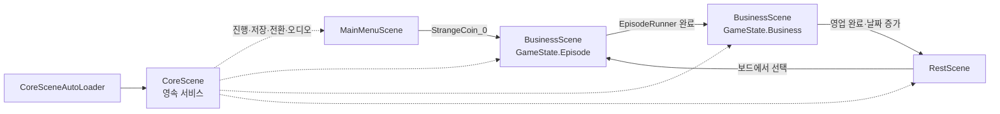
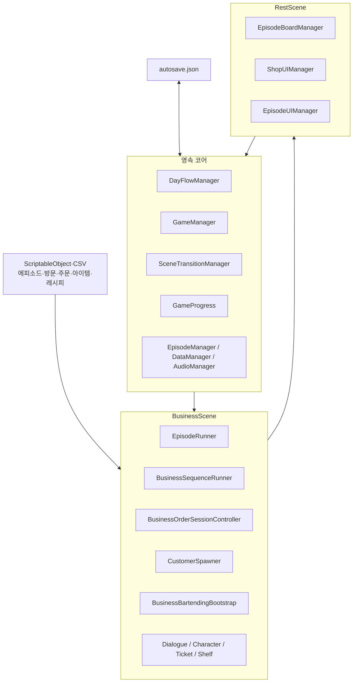
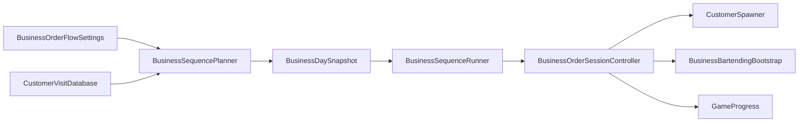

# Slainte 프로젝트 코드 지도

기준일: 2026-08-09
Unity: 6000.3.5f2
규모: 프로젝트 C# 163개, 런타임 136개, Editor 27개, 빌드 씬 4개

이 문서는 코드리뷰와 신규 작업의 공통 진입점이다. 결함 우선순위는 [현재 코드 리뷰](../code-review-2026-08-09.md), 구현 순서는 [구현 계획](../implementation-plan.md)을 사용한다.

## 1. 실행 흐름

에피소드와 영업은 서로 다른 씬이 아니다. 둘 다 `BusinessScene`을 사용하며, `GameState`와 `GameMode`로 실행 경로를 나눈다.

## 2. 상태 체계

| 범위 | 타입 | 소유자 | 값 |
|---|---|---|---|
| 하루·씬 | `GameState` | `GameManager` | `None`, `Episode`, `Business`, `Rest` |
| BusinessScene UI·입력 | `GameMode` | `GameModeManager` | `OrderMode`, `EpisodeMode`, `CraftingMode` |
| 주문 한 건 | `BusinessOrderSessionState` | `BusinessOrderSessionController` | `Idle`, `PresentingOrder`, `Crafting`, `Evaluating`, `PresentingFeedback`, `Completed` |
| 도구 하나 | 도구별 상태 | 각 Controller | 집기, 기울이기·회전, 복귀 |

주문 수락·거절 상태는 없다. 주문 대사가 끝나면 자동으로 제조에 들어가고, 잔을 전방 기준선 너머로 끌면 제출한다.

## 3. 계층 구조

의존 방향은 콘텐츠 데이터 → 실행기 → `GameProgress`다. UI는 진행 상태의 원본이 아니며, 저장은 `GameProgress`에서만 수거한다.

## 4. 코어 클래스

| 클래스 | 경로 | 책임 |
|---|---|---|
| `CoreSceneAutoLoader` | `Assets/CoreScene/Scripts` | 어느 씬에서 시작해도 CoreScene 추가 로드 |
| `MonoSingleton<T>` | `Assets/CoreScene/Scripts` | 전역 인스턴스 생성과 `DontDestroyOnLoad` |
| `SceneSingleton<T>` | `Assets/CoreScene/Scripts` | 씬 수명의 단일 인스턴스 |
| `DayFlowManager` | `Assets/CoreScene/Scripts` | 에피소드 → 영업 → 휴식 순서 |
| `GameManager` | `Assets/CoreScene/Scripts` | `GameState` 변경과 씬 선택 |
| `SceneTransitionManager` | `Assets/CoreScene/Scripts` | 페이드, 서브 씬 제거·추가 로드 |
| `EpisodeManager` | `Assets/CoreScene/Scripts` | 에피소드 로드, 표시·시작 가능 여부, 완료 기록 |
| `ProgressConditionEvaluator` | `Assets/Scripts/Core` | 에피소드·손님 공용 진행 조건 평가 |
| `GameProgress` | `Assets/Scripts` | 런타임 진행 상태의 단일 기준 |
| `DataManager` | `Assets/CoreScene/Scripts` | JSON 저장·로드 |
| `SaveData` | `Assets/CoreScene/Scripts` | 저장 DTO와 영업·방문 snapshot |

## 5. 에피소드 클래스

| 분류 | 클래스 | 책임 |
|---|---|---|
| 데이터 | `EpisodeData` | 에피소드 메타, 시작 노드, 노드 목록, 트리거 조건 |
| 데이터 | `EpisodeNode` | 대사, 캐릭터, 선택지, 분기, 제조, BGM |
| 데이터 | `EpisodeChoice` | 선택 효과와 다음 노드 |
| 조건 | `EpisodeTriggerCondition` | 날짜, 플래그, 완료 에피소드, 수치 조건 |
| 조건 | `NodeFlagBranch`, `NodeVarBranch` | 노드 내부 분기 |
| 실행 | `EpisodeRunner` | 노드 실행, 선택, 제조 요청, 완료 |
| 대사 | `DialogueController` | 타이핑, 진행, 닫힘 이벤트 |
| 표시 | `CharacterStage`, `CharacterView` | 캐릭터 슬롯, 표정, 등장·퇴장, 눈 깜박임 |
| 데이터 | `CharacterData`, `CharacterDatabase` | 캐릭터 스프라이트와 키 조회 |

현재 제품 런타임은 `EpisodeData → EpisodeManager → EpisodeRunner`다. `NarrativeGraphSO`는 에디터 입력 경로로 `EpisodeData`를 만들 수 있고, `NarrativeManager`의 베이크 JSON 런타임은 현재 별도 경로다.

## 6. 영업과 손님 풀

| 클래스 | 책임 |
|---|---|
| `BusinessFlowBootstrap` | BusinessScene 의존성 탐색과 런타임 컴포넌트 조립 |
| `BusinessOrderFlowSettings` | 고정/손님 풀 모드, 방문 수, 판정 기준, 보상 |
| `BusinessSequencePlanner` | 조건 필터와 결정론적 가중치 추첨 |
| `BusinessSequenceRunner` | 오늘 목록 실행, 방문 이력·index 저장 |
| `BusinessOrderSessionController` | 주문 제시, 제조, 판정, 피드백, 보상, 완료 |
| `OrderSessionRequest` | 영업/에피소드 호출 정책 |
| `CustomerVisitData` | 구성원, 등장 조건, 가중치, 재등장 대기, 주문 후보 |
| `CustomerOrderData` | 주문 대사, 결과 대사, 내부 레시피 ID |
| `CustomerSpawner` | 방문 구성원 전원 표시와 결과 표정 교체 |

개인·커플·단체는 별도 타입이 아니다. `CustomerVisitData.members` 개수로 모든 방문을 표현한다. 현재 기본 설정은 `CustomerPool`이며 유카리 샘플 방문 한 건을 사용한다.

## 7. 공용 주문과 바텐딩

영업과 에피소드는 `BusinessOrderSessionController`에서 합쳐지고 결과 처리에서 다시 갈라진다.

| 호출자 | 손님 연출 | 피드백 | 돈·명성 | 완료 후 |
|---|---|---|---|---|
| 영업 | 표시 | 표시 | 적용 | 다음 영업 entry |
| 에피소드 | 생략 | 생략 | 미적용 | Good/Bad 노드 분기 |

바텐딩 핵심 클래스:

| 영역 | 클래스 | 책임 |
|---|---|---|
| 세션 | `BusinessBartendingBootstrap` | 별도 물리 월드·카메라·도구·슬롯·액체 풀 생성 |
| 화면 | `BartendingViewport` | RenderTexture와 포인터 좌표 변환 |
| 도구 | `BottleController` | 병 집기, 따르기, 재고 차감 |
| 도구 | `GlassController` | 잔 이동, 스타일, 전방 제출 |
| 도구 | `BeakerController` | 비커·셰이커 이동과 기울이기 |
| 도구 | `StirringRodController` | 막대 젓기와 `Stir` 기록 |
| 도구 | `CobblerShakerTechniqueController` | 왕복 흔들기와 `Shake` 기록 |
| 순서 | `BartendingItemOrder` | 겹친 도구의 클릭 우선순위 |
| 액체 | `LiquidParticleData`, `LiquidPayload` | 재료별 ml, 온도, 제조법, 색상 |
| 용기 | `VesselLiquidTracker` | 입자 소유권과 최종 조성 생성 |
| 김 | `GlassSteamEmitter` | 뜨거운 표면 입자 기반 김 생성 |
| 판정 | `CocktailEvaluator` | 실제 조성과 레시피 비교 |
| 주문 판정 | `CocktailOrderEvaluator`, `OrderEvaluationGrader` | 주문 성공과 Good·Mid·Bad 결정 |

`LiquidPool`, `LiquidReaction`, `ReturnToPool`, `FullScreenQuad`는 `Assets/MetaballFluid/Scripts`에서 입자 재사용, 충돌 혼합, 화면 밖 반환, 메타볼 표시를 담당한다.

## 8. UI와 입력

| 클래스 | 책임 |
|---|---|
| `GameModeManager` | BusinessScene 패널과 조작 가능 상태 |
| `InputRouter` | 현재 모드에 따라 대사·카메라·책·주문서·술장 입력 전달 |
| `FrontCameraRig` | 서랍 세로 이동과 캐릭터 포커스 가로 이동 |
| `OrderTicketManager`, `OrderTicketUI` | 주문서 준비와 슬라이드 표시 |
| `RecipeBookUI`, `RecipeSearchUI` | 레시피북 패널과 검색 UI |
| `LiquorShelfUI`, `LiquorBottleSlotUI` | 술장 분류, 병 선택, 제조 세션 배치 |
| `DragManager`, `UIItemDraggable`, `UIDropSlot` | 이전 UI 드래그 계층과 테이블 배치 |

주문서에는 대사만 노출하고 내부 레시피 ID·가격·요구 수량은 표시하지 않는다.

## 9. RestScene

| 클래스 | 책임 |
|---|---|
| `BaseUIManager` | 휴식 패널 열기·닫기 공통 기반 |
| `EpisodeBoardManager` | 에피소드 표시, 사진 슬롯, 선택·시작 |
| `EpisodePhotoTrigger`, `EpisodeInfoUI` | 사진 상호작용과 상세 팝업 |
| `ShopUIManager`, `ItemSlotUI` | 상점 분류·검색·표시 |
| `EpisodeUIManager` | 돈과 영업 상태 현황 UI |
| `TooltipManager` 계열 | 공용 툴팁 |

현재 상점 구매는 로그만 남기며 제조 재고와 연결되지 않는다. `RestScene.ItemData`와 제조용 `ItemDef`는 별도 모델이다.

## 10. 데이터 위치

| 데이터 | 위치 | 소비자 |
|---|---|---|
| 에피소드 | `Assets/Resources/EpisodeData` | `EpisodeManager` |
| 캐릭터 | `Assets/Data/CharacterData` | `CharacterDatabase` |
| 주문 | `Assets/Data/CustomerOrder` | `CustomerOrderDatabase` |
| 방문 풀 | `Assets/Resources/CustomerVisit` | `CustomerVisitDatabase` |
| 주문서 | `Assets/Data/OrderTicket` | `OrderTicketDatabase` |
| 제조 아이템 | `Assets/Resources/Items` | `ItemDefCatalog` |
| 술장 병 | `Assets/Data/LiquorBottle` | `LiquorShelfUI` |
| 레시피 에셋 | `Assets/Resources/Recipes` | `CocktailRecipeDataLoader` |
| 호환 CSV | `Assets/StreamingAssets/Data` | 레시피·주문 CSV 로더 |
| 영업 설정 | `Assets/Resources/Business` | `BusinessFlowBootstrap` |
| 바텐딩 설정 | `Assets/Resources/Bartending` | `BusinessBartendingBootstrap` |

문자열 ID가 시스템 사이의 외래 키다. `episodeId`, `nodeId`, `characterKey`, `visitKey`, `customerOrderKey`, `ticketKey`, `recipeId`, `ingredientId`를 변경할 때 관련 데이터 전체를 검증해야 한다.

## 11. Editor 도구

| 클래스 | 메뉴·역할 |
|---|---|
| `EpisodeCsvImporter` | 에피소드 CSV → `EpisodeData` |
| `PlanningCsvAssetImporter` | 기획 아이템·레시피 CSV → 런타임 에셋 |
| `CustomerPoolSetup` | 손님 풀 샘플 설정과 자동 검증 |
| `BusinessFlowSceneSetup` | 영업 세로 절단 설정·검증 |
| `BartendingSystemValidator` | 바텐딩 데이터·판정 검증 |
| `CobblerShakerSetup` | 코블러 셰이커 프리팹과 설정 |
| `NarrativeGraphEditor` 계열 | 그래프 편집, 컴파일, 베이크 |

## 12. 리뷰 진입 순서

1. `DayFlowManager`, `GameManager`, `SceneTransitionManager`
2. `GameProgress`, `SaveData`, `DataManager`
3. `EpisodeManager`, `EpisodeRunner`
4. `BusinessFlowBootstrap`, `BusinessSequencePlanner`, `BusinessSequenceRunner`
5. `CustomerVisitData`, `CustomerSpawner`, `BusinessOrderSessionController`
6. `BusinessBartendingBootstrap`, `VesselLiquidTracker`, 판정 클래스
7. RestScene UI와 Editor 임포터

구체적인 위험 항목과 검증 절차는 [현재 코드 리뷰](../code-review-2026-08-09.md)를 따른다.
