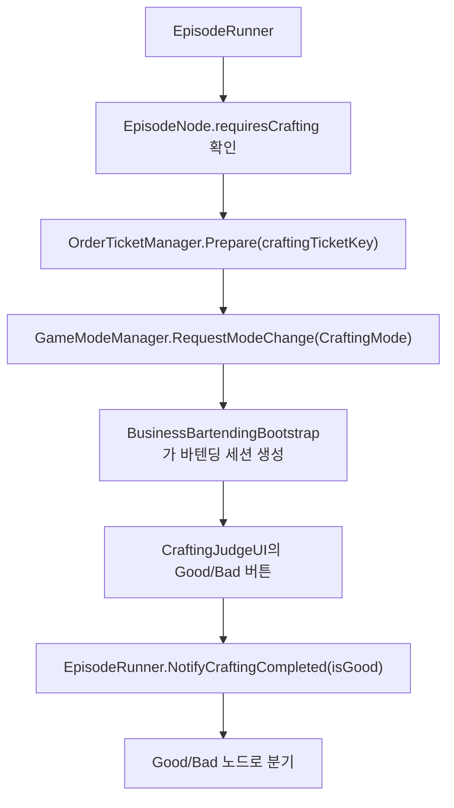
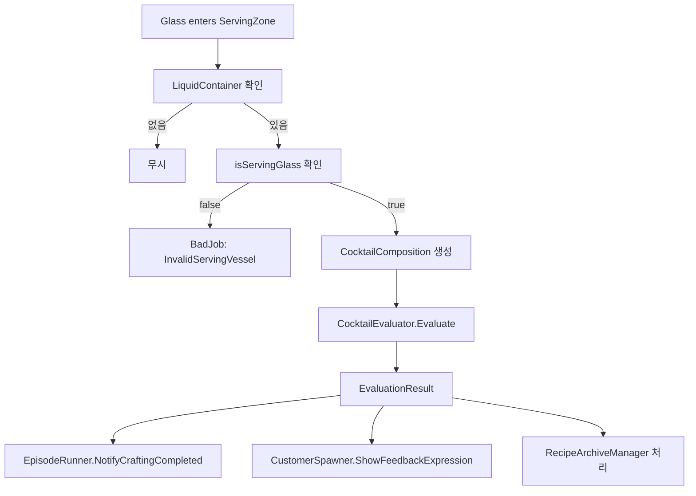
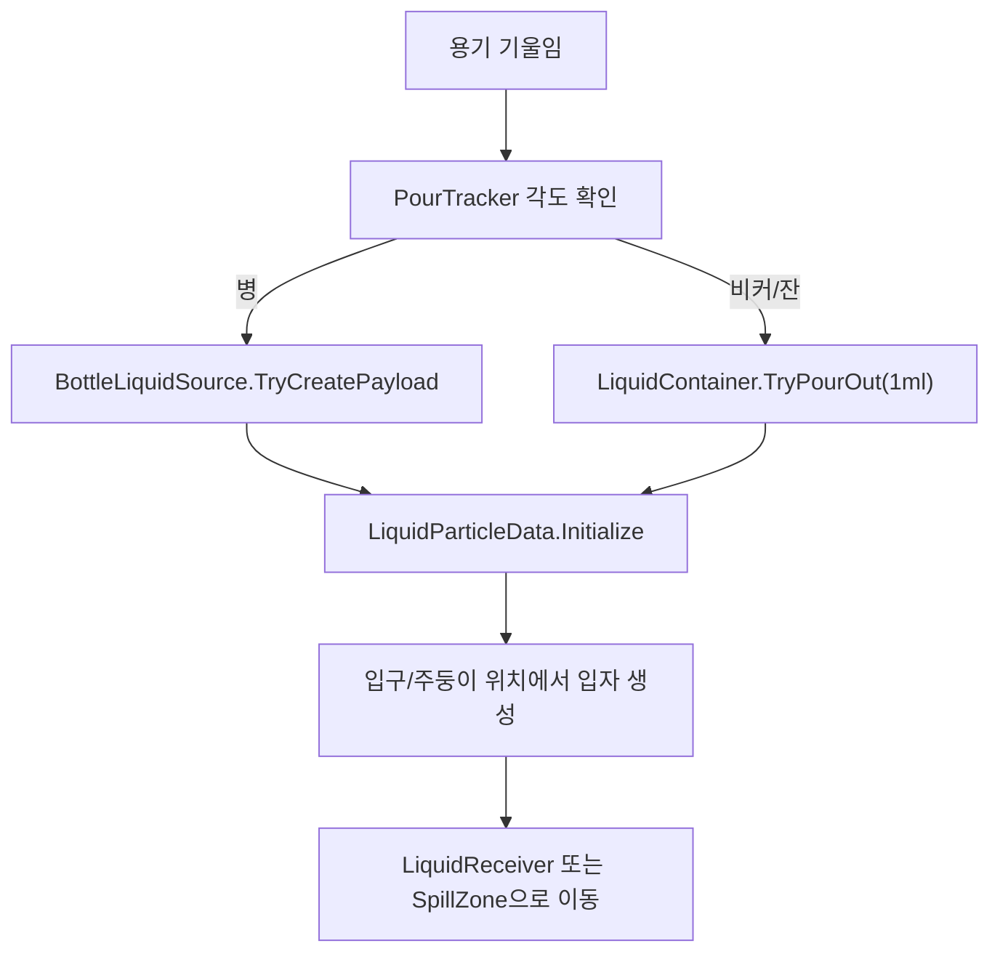
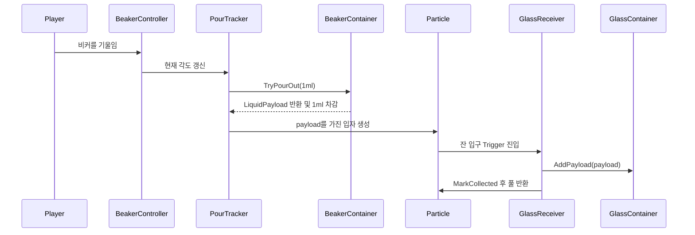

# 액체 메카닉 및 칵테일 평가 요구사항 반영 계획서

문서 버전: v1  
작성 기준일: 2026-06-29  
대상 요구사항 문서: `docs/liquid-cocktail-requirements.md`

---

## 1. 목적

이 문서는 현재 Unity 프로젝트의 기존 코드, 문서, UML 다이어그램을 기준으로 액체 메카닉 및 칵테일 평가 요구사항을 어떤 구조로 반영할지 정리한다.

목표는 다음과 같다.

- 기존 바텐딩 조작과 Metaball 액체 표현을 최대한 유지한다.
- 수동 `GoodJob / BadJob` 판정을 자동 평가 시스템으로 교체한다.
- 재료, 레시피, 주문, 평가 규칙을 기획자가 관리 가능한 ScriptableObject 데이터로 만든다.
- 공식/변형/수제/에피소드 레시피를 같은 평가 로직으로 처리한다.
- 에피소드 분기, 주문 티켓, 손님 대사, 저장 데이터와 자연스럽게 연결한다.

---

## 2. 참고한 프로젝트 자료

### 2.1 요구사항 문서

| 파일 | 활용 내용 |
|---|---|
| `docs/liquid-cocktail-requirements.md` | 최종 요구사항. 액체, 재료, 레시피, 주문, 평가, 아카이빙 기준 |

### 2.2 UML 다이어그램

| 파일 | 활용 내용 |
|---|---|
| `docs/uml-usecase.puml` | 플레이어가 주문 확인, 제작 모드 진입, 바텐딩 아이템 조작, 결과 판정을 수행하는 흐름 |
| `docs/uml-class-diagram.puml` | Core, Episode, OrderTicket, Bartending, MetaballFluid, Editor Tools의 현재 클래스 관계 |
| `docs/uml-diagrams.md` | 다이어그램 범위와 현재 런타임 흐름 설명 |

### 2.3 기존 코드

| 영역 | 주요 파일 | 현재 역할 |
|---|---|---|
| 바텐딩 런타임 | `Assets/Scripts/Bartending/BottleController.cs` | 병 픽업, 기울이기, 액체 입자 스폰 |
| 바텐딩 런타임 | `Assets/Scripts/Bartending/BeakerController.cs` | 비커 픽업, 슬롯 배치, 기울이기 |
| 바텐딩 런타임 | `Assets/Scripts/Bartending/GlassController.cs` | 잔 픽업, 슬롯 배치, 기울이기 |
| 바텐딩 런타임 | `Assets/Scripts/Bartending/SlotController.cs` | 슬롯 점유 상태 관리 |
| 바텐딩 런타임 | `Assets/Scripts/Bartending/BusinessBartendingBootstrap.cs` | CraftingMode 진입 시 바텐딩 세션 자동 생성 |
| 바텐딩 설정 | `Assets/Scripts/Bartending/BusinessBartendingSettings.cs` | 비커/잔/병/슬롯/액체 프리팹 설정 |
| 액체 표현 | `Assets/MetaballFluid/Scripts/LiquidPool.cs` | 액체 입자 풀링 |
| 액체 표현 | `Assets/MetaballFluid/Scripts/LiquidReaction.cs` | 액체 입자 색상/물성 평균화 |
| 손님 주문 | `Assets/Scripts/Conversation/Sell/CustomerOrderData.cs` | 손님 대사와 피드백 데이터 |
| 손님 주문 | `Assets/Scripts/Conversation/Sell/CustomerSpawner.cs` | 손님 등장, 대사 시작, 주문 티켓 준비 |
| 주문 티켓 | `Assets/Scripts/OrderTicket/OrderTicketData.cs` | 티켓 표시 데이터 |
| 주문 티켓 | `Assets/Scripts/OrderTicket/OrderTicketManager.cs` | 대사 종료/제작 모드 진입 시 티켓 표시 |
| 에피소드 | `Assets/Scripts/Conversation/Episode/EpisodeNode.cs` | 제작 요구 노드와 Good/Bad 분기 데이터 |
| 에피소드 | `Assets/Scripts/Conversation/Episode/EpisodeRunner.cs` | CraftingMode 전환 및 제작 결과 분기 |
| 제작 판정 UI | `Assets/Scripts/Conversation/Episode/CraftingJudgeUI.cs` | 현재 수동 Good/Bad 버튼 |
| 진행 저장 | `Assets/Scripts/GameProgress.cs` | 플래그, 에피소드 클리어, 친밀도, 보드 슬롯 |
| 저장 | `Assets/CoreScene/Scripts/DataManager.cs` | GameProgress를 SaveData에 저장 |
| 저장 데이터 | `Assets/CoreScene/Scripts/SaveData.cs` | 저장 가능한 진행 데이터 구조 |

---

## 3. 현재 구조 요약

### 3.1 제작 모드 진입 흐름

현재 에피소드 제작 흐름은 다음 구조다.



이 구조는 제작 모드 진입과 에피소드 분기까지는 이미 잘 준비되어 있다.

반영 방향:

- `CraftingJudgeUI`의 수동 버튼을 자동 평가 결과로 대체한다.
- 디버그용으로 버튼을 남길 수는 있지만, 실제 게임 판정 경로는 `ServingZone -> CocktailEvaluator -> EpisodeRunner.NotifyCraftingCompleted()`로 바꾼다.

### 3.2 바텐딩 세션 생성 흐름

`BusinessBartendingBootstrap`은 `BusinessScene`에서 자동 설치되며, `CraftingMode`가 되면 런타임 바텐딩 월드를 만든다.

현재 생성 대상:

- 바텐딩 카메라
- 바텐딩 뷰포트
- 슬롯
- 병
- 비커
- 잔
- 액체 풀

반영 방향:

- 이 흐름은 유지한다.
- 생성 시 `BartendingSessionController`, `ServingZone`, `CocktailEvaluationContext`를 함께 붙인다.
- `BusinessBartendingSettings`에 칵테일 데이터베이스와 평가 설정 참조를 추가한다.

### 3.3 액체 표현 구조

현재 병은 기울어졌을 때 `LiquidPool.Instance.GetParticle()`로 액체 입자를 스폰한다.

현재 한계:

- 액체 입자에 어떤 재료인지 정보가 없다.
- 입자 1개가 몇 ml인지 정의되어 있지 않다.
- 어떤 용기에 들어갔는지 의미 데이터가 없다.
- 비커와 잔에는 내용물 구성을 추적하는 데이터가 없다.

반영 방향:

- 액체 입자에는 시각/물리 표현을 맡긴다.
- 실제 평가용 재료/용량은 `LiquidContainer`와 `LiquidPortion`에서 추적한다.
- 병에서 액체가 나올 때 `IngredientData`와 `mlPerParticle`을 함께 기록한다.

---

## 4. 핵심 설계 방향

### 4.1 기존 시스템을 대체하지 않고 덧붙인다

기존 파일을 크게 갈아엎지 않는다.

유지할 것:

- `BottleController`, `BeakerController`, `GlassController`의 픽업/드롭/기울이기 조작
- `SlotController`의 점유 관리
- `BusinessBartendingBootstrap`의 CraftingMode 기반 세션 생성
- `LiquidPool`, `LiquidReaction`의 액체 시각화
- `EpisodeRunner`의 제작 모드 전환 및 Good/Bad 분기
- `OrderTicketManager`의 주문 티켓 표시

추가할 것:

- 재료/레시피/주문 데이터
- 용기별 액체 구성 추적
- 기법 추적
- 제출 영역
- 자동 평가
- 레시피 해금/아카이브 진행 저장
- 기획자 검증 도구

### 4.2 의미 데이터 레이어를 새로 만든다

새 시스템은 다음 계층으로 나눈다.

| 계층 | 역할 |
|---|---|
| Visual Liquid Layer | 기존 Metaball 입자, 색상, 물리 표현 |
| Semantic Liquid Layer | 재료 ID, 용량, 도수, 맛, 밀도, 섞임 상태 |
| Evaluation Layer | 레시피 매칭, 주문 평가, Good/Bad 판정 |
| Progress Layer | 해금 횟수, 레시피 공개, 비공식 레시피북 저장 |
| Editor/Data Layer | 기획 데이터 입력, 검증, 미리보기 |

---

## 5. 신규 폴더 구조 제안

새 코드는 기존 `Bartending` 코드와 섞어도 되지만, 평가/데이터가 커질 가능성이 크므로 `Cocktail` 영역을 분리하는 것을 권장한다.

```text
Assets/
  Scripts/
    Cocktail/
      Data/
      Runtime/
      Evaluation/
      Progress/
      Editor/
    Bartending/
      기존 파일 유지
  Data/
    Cocktail/
      Ingredients/
      Recipes/
      Orders/
      Glasses/
      Tools/
      Settings/
```

권장 이유:

- 바텐딩 조작 코드와 평가 규칙 코드의 책임을 분리할 수 있다.
- 레시피/주문 데이터가 늘어나도 기존 컨트롤러가 비대해지지 않는다.
- 기획자용 데이터 검증 도구를 독립적으로 만들기 쉽다.

---

## 6. 데이터 설계 반영 계획

### 6.1 공통 enum

위치:

```text
Assets/Scripts/Cocktail/Data/CocktailEnums.cs
```

추가할 enum:

```csharp
public enum TasteTag
{
    Sweet,
    Bitter,
    Sour,
    SweetSour,
    RichSweet,
    Neutral
}

public enum MoodTag
{
    Refreshing,
    Luxurious,
    Cozy,
    Fancy,
    Clean
}

public enum RecipeType
{
    Official,
    Variant,
    Custom,
    EpisodeOnly
}

public enum ArchiveBookType
{
    None,
    OfficialBook,
    UnofficialBook
}

public enum TechniqueType
{
    None,
    Build,
    Stir,
    Shake,
    DryShake
}

public enum MixingRequirement
{
    Any,
    Mixed,
    Layered,
    Unmixed
}

public enum IceRequirement
{
    Any,
    NoIce,
    WithIce
}
```

표시 이름은 enum 이름이 아니라 별도 localization/displayName으로 관리한다.

예시:

- `Sweet` -> `달콤함`
- `Bitter` -> `쌉쌀함`
- `Refreshing` -> `청량한`

### 6.2 IngredientData

위치:

```text
Assets/Scripts/Cocktail/Data/IngredientData.cs
Assets/Scripts/Cocktail/Data/IngredientDatabase.cs
```

역할:

- 재료의 맛, 도수, 밀도, 색상, 가격, 병 용량을 정의한다.
- `BottleController` 또는 신규 `BottleLiquidSource`가 참조한다.
- `RecipeMatcher`와 `CocktailComposition` 계산에 사용한다.

주요 필드:

```csharp
[CreateAssetMenu(menuName = "Slainte/Cocktail/Ingredient")]
public sealed class IngredientData : ScriptableObject
{
    public string ingredientId;
    public string displayName;
    public string originalName;
    public TasteTag tasteTag;
    public float abvPercent;
    public float density;
    public Color color;
    public string category;
    public string ingredientType;
    public float bottleVolumeMl;
    public int price;
}
```

### 6.3 RecipeData

위치:

```text
Assets/Scripts/Cocktail/Data/RecipeData.cs
Assets/Scripts/Cocktail/Data/RecipeDatabase.cs
```

역할:

- 공식/변형/수제/에피소드 레시피를 모두 표현한다.
- `RecipeMatcher`의 기준 데이터다.
- 레시피북 아카이빙에도 사용한다.

주요 필드:

```csharp
[CreateAssetMenu(menuName = "Slainte/Cocktail/Recipe")]
public sealed class RecipeData : ScriptableObject
{
    public string recipeId;
    public string displayName;
    public string hiddenName;
    public RecipeType recipeType;
    public ArchiveBookType archiveBookType;
    public List<RecipeIngredient> ingredients;
    public string requiredGlassType;
    public TechniqueType requiredTechnique;
    public MixingRequirement mixingRequirement;
    public List<TasteTag> tasteTags;
    public List<MoodTag> moodTags;
    public IceRequirement iceRequirement;
    public float tolerancePercent = 5f;
    public int revealAfterGoodJobCount;
    public List<DialogueLine> beforeRevealOrderLines;
    public List<DialogueLine> afterRevealOrderLines;
}
```

### 6.4 CocktailOrderData

현재 `CustomerOrderData`는 손님, 대사, 피드백만 담는다. 칵테일 평가 조건을 추가하기에는 책임이 커지므로 별도 `CocktailOrderData`를 만들고 `CustomerOrderData`에서 참조하는 방식을 권장한다.

위치:

```text
Assets/Scripts/Cocktail/Data/CocktailOrderData.cs
Assets/Scripts/Cocktail/Data/CocktailOrderDatabase.cs
```

`CustomerOrderData` 확장:

```csharp
public CocktailOrderData cocktailOrder;
```

주요 필드:

```csharp
[CreateAssetMenu(menuName = "Slainte/Cocktail/Order")]
public sealed class CocktailOrderData : ScriptableObject
{
    public string orderId;
    public OrderType orderType;
    public RecipeData requestedRecipe;
    public TechniqueType overrideTechnique;
    public string overrideGlassType;
    public List<TasteTag> requiredTasteTags;
    public List<MoodTag> requiredMoodTags;
    public float minAbvPercent;
    public float maxAbvPercent;
    public bool useAbvRange;
    public bool oneTimeEpisodeAnswer;
}
```

### 6.5 EvaluationSettings

위치:

```text
Assets/Scripts/Cocktail/Data/EvaluationSettings.cs
Assets/Data/Cocktail/Settings/EvaluationSettings.asset
```

주요 필드:

```csharp
[CreateAssetMenu(menuName = "Slainte/Cocktail/Evaluation Settings")]
public sealed class EvaluationSettings : ScriptableObject
{
    public float recipeTolerancePercent = 5f;
    public float shotMl = 30f;
    public float stirRequiredSeconds = 3f;
    public bool failOnExtraTechnique = true;
    public bool requireGlassMatch = true;
    public bool evaluateIceAndTemperature = false;
    public bool allowUnknownRecipe = false;
}
```

---

## 7. 런타임 액체 의미 데이터 반영 계획

### 7.1 BottleController 확장

현재 `BottleController`는 `ItemDef bottleData`를 가지고 있고, 기울이면 액체 입자를 스폰한다.

문제:

- `ItemDef`에는 id, type, icon 정도만 있다.
- 어떤 액체인지, 도수/맛/밀도는 없다.
- `currentCapacity` 단위가 ml이 아니라 입자 개수처럼 쓰인다.

계획:

1. `BottleController`는 조작만 유지한다.
2. 병의 내용물 의미 데이터는 신규 `BottleLiquidSource`가 담당한다.
3. `BottleLiquidSource`는 `IngredientData`, `remainingVolumeMl`, `mlPerParticle`을 가진다.
4. `BottleController.SpawnLiquid()` 시 `BottleLiquidSource.TryEmit()`을 호출한다.
5. 스폰된 입자에는 `LiquidParticleData`를 붙여 재료 ID, ml, 색상, 밀도를 설정한다.

신규 컴포넌트:

```text
Assets/Scripts/Cocktail/Runtime/BottleLiquidSource.cs
Assets/Scripts/Cocktail/Runtime/LiquidParticleData.cs
```

### 7.2 LiquidParticleData

액체 입자에 재료 의미를 붙인다.

```csharp
public sealed class LiquidParticleData : MonoBehaviour
{
    public IngredientData ingredient;
    public float volumeMl;
}
```

입자가 풀에서 재사용되므로, 입자를 꺼낼 때마다 반드시 초기화해야 한다.

초기화 내용:

- `ingredient`
- `volumeMl`
- `SpriteRenderer.color`
- `Rigidbody2D.mass`
- `Rigidbody2D.gravityScale`

밀도 표현은 기존 `LiquidReaction`의 mass 평균화와 연결할 수 있다.

### 7.3 LiquidContainer

비커와 잔에는 내용물 구성을 추적하는 `LiquidContainer`를 붙인다.

위치:

```text
Assets/Scripts/Cocktail/Runtime/LiquidContainer.cs
```

역할:

- 재료별 용량 누적
- 총량 계산
- 다른 용기로 붓기
- 내용물 비우기
- CocktailComposition 생성 시 데이터 제공

필드 예시:

```csharp
public sealed class LiquidContainer : MonoBehaviour
{
    public string containerId;
    public string glassType;
    public bool isServingGlass;
    public List<LiquidPortion> portions;
}
```

### 7.4 LiquidPortion

```csharp
[Serializable]
public sealed class LiquidPortion
{
    public IngredientData ingredient;
    public float volumeMl;
}
```

### 7.5 용기에 액체가 들어가는 방식

v1에서 권장하는 방식은 `LiquidContainerCollector`다.

```text
Assets/Scripts/Cocktail/Runtime/LiquidContainerCollector.cs
```

역할:

- 비커/잔 내부에 Trigger 영역을 둔다.
- `LiquidParticleData`가 붙은 입자가 Trigger에 들어오면 해당 재료와 용량을 `LiquidContainer`에 더한다.
- 입자는 시각적으로 계속 존재해도 되지만, 평가 데이터는 이 시점에 누적한다.

주의:

- 같은 입자가 여러 번 들어오면 중복 누적될 수 있으므로 `LiquidParticleData`에 `hasBeenCollected` 같은 플래그가 필요하다.
- 비커에서 잔으로 붓는 경우에는 새 입자가 잔에 들어가면서 잔의 `LiquidContainer`에 누적되어야 한다.
- 비커의 기존 내용물을 줄이는 처리가 필요하므로, 붓기 시작 시 `PourTracker`가 출발 용기의 용량을 함께 차감하는 방식을 추가해야 한다.

### 7.6 PourTracker

`BottleController`, `BeakerController`, `GlassController`에 공통으로 붙일 수 있는 보조 컴포넌트다.

위치:

```text
Assets/Scripts/Cocktail/Runtime/PourTracker.cs
```

역할:

- 현재 오브젝트가 기울어진 상태인지 확인한다.
- 어떤 `LiquidContainer`에서 액체가 나가는지 확인한다.
- 입자 스폰/수집과 맞춰 의미 용량을 이동한다.
- 흘린 액체는 평가 대상에서 제외한다.

우선순위:

1. 병 -> 비커/잔
2. 비커 -> 잔
3. 잔 -> 비커
4. 용기 밖으로 흘림

---

## 8. 기법 추적 반영 계획

### 8.1 TechniqueTracker

위치:

```text
Assets/Scripts/Cocktail/Runtime/TechniqueTracker.cs
```

역할:

- 제작 중 사용된 기법 목록을 기록한다.
- `CocktailComposition` 생성 시 사용 기법을 제공한다.
- 여러 기법 사용 여부를 평가한다.

예시:

```csharp
public sealed class TechniqueTracker : MonoBehaviour
{
    public IReadOnlyList<TechniqueType> UsedTechniques => usedTechniques;
    public void Record(TechniqueType technique);
}
```

### 8.2 Stir 판정

신규 도구:

```text
Assets/Scripts/Cocktail/Runtime/BarSpoonController.cs
```

또는 공통 도구:

```text
Assets/Scripts/Cocktail/Runtime/BartendingToolController.cs
```

Stir 조건:

- 바스푼이 `LiquidContainer` 내부 Trigger에 들어가 있다.
- 좌우 이동이 감지된다.
- 누적 시간이 `EvaluationSettings.stirRequiredSeconds` 이상이다.

결과:

- 해당 용기의 `MixingTracker`가 `Mixed` 상태가 된다.
- 세션의 `TechniqueTracker`에 `Stir`가 기록된다.

### 8.3 Shake/DryShake 판정

신규 도구:

```text
Assets/Scripts/Cocktail/Runtime/ShakerAttachment.cs
Assets/Scripts/Cocktail/Runtime/ShakeTracker.cs
```

조건:

- 셰이커 캡 또는 뚜껑이 비커와 결합되어 있다.
- 결합 상태에서 일정량 이상의 흔들림이 감지된다.
- 얼음 평가가 비활성인 v1에서는 기본적으로 `Shake` 또는 `DryShake`를 데이터 설정에 맞춰 처리한다.

결과:

- 세션의 `TechniqueTracker`에 `Shake` 또는 `DryShake`가 기록된다.
- 해당 용기의 `MixingTracker`가 `Mixed` 상태가 된다.

### 8.4 Build 판정

Build는 명시적 도구 사용 없이 잔에 직접 부은 경우다.

판정:

- 최종 제출 잔에 액체가 있다.
- `TechniqueTracker`에 `Stir`, `Shake`, `DryShake`가 없다.
- 레시피 요구 기법이 `Build`면 일치로 처리한다.

---

## 9. 제출 및 자동 평가 반영 계획

### 9.1 ServingZone 추가

위치:

```text
Assets/Scripts/Cocktail/Runtime/ServingZone.cs
```

역할:

- 손님에게 제출하는 영역을 나타낸다.
- `GlassController` 또는 `LiquidContainer.isServingGlass == true`인 오브젝트가 들어오면 제출 후보로 본다.
- 잔 안에 액체가 있으면 평가를 실행한다.

동작:



### 9.2 CocktailComposer

위치:

```text
Assets/Scripts/Cocktail/Evaluation/CocktailComposer.cs
```

역할:

- 제출된 잔의 `LiquidContainer`에서 `CocktailComposition`을 만든다.
- `TechniqueTracker`, `MixingTracker`, 잔 타입, 얼음 여부를 함께 읽는다.

### 9.3 CocktailEvaluator

위치:

```text
Assets/Scripts/Cocktail/Evaluation/CocktailEvaluator.cs
```

역할:

- `RecipeMatcher`로 제출물이 어떤 레시피인지 찾는다.
- `OrderEvaluator`로 주문 조건 충족 여부를 확인한다.
- 최종 `EvaluationResult`를 반환한다.

구성:

```text
CocktailEvaluator
  -> RecipeMatcher
  -> OrderEvaluator
  -> AbvCalculator
  -> TasteProfileCalculator
```

### 9.4 RecipeMatcher

위치:

```text
Assets/Scripts/Cocktail/Evaluation/RecipeMatcher.cs
```

판정 조건:

- 재료 구성 일치
- 재료별 용량 5% 허용 오차 이내
- 추가 재료 없음
- 잔 일치
- 기법 일치
- 섞임 상태 일치

### 9.5 OrderEvaluator

위치:

```text
Assets/Scripts/Cocktail/Evaluation/OrderEvaluator.cs
```

판정 조건:

- 레시피 주문: 매칭된 레시피가 요구 레시피인지 확인
- 기법/잔 변경 주문: 유지 조건과 변경 조건을 분리해 확인
- 맛 주문: 맛 프로필에 요구 맛이 포함되는지 확인
- 분위기 주문: 매칭된 레시피의 분위기가 요구 분위기인지 확인
- 도수 주문: 계산 ABV가 요구 범위인지 확인
- 에피소드 주문: 에피소드 전용 조건 확인

---

## 10. 주문/티켓 시스템 반영 계획

### 10.1 CustomerOrderData 확장

현재 `CustomerOrderData`는 대사와 피드백만 가진다.

추가:

```csharp
public CocktailOrderData cocktailOrder;
```

이렇게 하면 기존 `CustomerSpawner`, `DialogueController`, 피드백 라인은 그대로 유지하면서 평가 조건만 별도 데이터로 분리할 수 있다.

### 10.2 OrderTicketData 확장 또는 자동 생성

현재 `OrderTicketData`는 `customerName`, `memo`, `items`를 가진다.

선택지:

1. 기존 `OrderTicketData`를 유지하고 기획자가 수동 작성한다.
2. `CocktailOrderData`에서 티켓 내용을 자동 생성한다.

v1 권장:

- 기존 `OrderTicketData`를 유지한다.
- `CocktailOrderData` 참조만 추가한다.
- 나중에 자동 생성 기능을 Editor 도구로 확장한다.

### 10.3 현재 주문 컨텍스트

평가 시 현재 주문을 알아야 한다.

신규 클래스:

```text
Assets/Scripts/Cocktail/Runtime/CurrentCocktailOrderContext.cs
```

역할:

- 현재 손님 또는 에피소드 제작 노드의 `CocktailOrderData`를 보관한다.
- `ServingZone`이 평가할 때 현재 주문을 제공한다.
- `CustomerSpawner` 또는 `EpisodeRunner`가 제작 시작 시 설정한다.

---

## 11. 에피소드 시스템 반영 계획

### 11.1 EpisodeNode 확장

현재 `EpisodeNode`에는 다음 제작 필드가 있다.

- `requiresCrafting`
- `craftingTicketKey`
- `nextNodeIdGood`
- `nextNodeIdBad`
- `craftingFlagGood`
- `craftingFlagBad`
- `craftingVarChangesGood`
- `craftingVarChangesBad`

추가 권장:

```csharp
public CocktailOrderData craftingCocktailOrder;
```

또는 string key 방식:

```csharp
public string craftingCocktailOrderKey;
```

프로젝트의 기존 DB 패턴은 key 조회 방식이 많으므로, 에피소드 CSV/컴파일러와 연결하려면 `craftingCocktailOrderKey`가 더 안전하다.

### 11.2 EpisodeRunner 연결

현재 `EpisodeRunner.HandleCraftingNode()`는 티켓만 준비하고 CraftingMode로 전환한다.

변경:

```text
HandleCraftingNode()
  -> ticketManager.Prepare(node.craftingTicketKey)
  -> currentCocktailOrderContext.Set(node.craftingCocktailOrderKey)
  -> modeManager.RequestModeChange(CraftingMode)
```

평가 완료 후:

```text
ServingZone
  -> CocktailEvaluator
  -> EpisodeRunner.NotifyCraftingCompleted(result.grade == GoodJob)
```

기존 Good/Bad 분기 로직은 그대로 재사용한다.

### 11.3 CraftingJudgeUI 처리

현재 `CraftingJudgeUI`는 수동 버튼으로 결과를 넣는다.

v1 처리안:

- 디버그 빌드 또는 에디터에서만 사용하도록 둔다.
- 실제 평가 경로에서는 `ServingZone`이 자동으로 `NotifyCraftingCompleted()`를 호출한다.
- UI 이름은 `CraftingDebugJudgeUI`로 변경하는 것도 고려한다.

---

## 12. 진행 저장 및 레시피북 반영 계획

### 12.1 GameProgress 확장

현재 `GameProgress`는 flags, completedEpisodeIds, affinity, boardSlot을 관리한다.

추가해야 할 진행 데이터:

- 레시피별 GoodJob 성공 횟수
- 공개된 레시피 ID 목록
- 공식 레시피북 등록 상태
- 비공식 레시피북 등록 상태

필드 예시:

```csharp
[SerializeField] private List<string> recipeGoodJobKeys = new();
[SerializeField] private List<int> recipeGoodJobValues = new();
[SerializeField] private List<string> revealedRecipeIds = new();
[SerializeField] private List<string> officialBookRecipeIds = new();
[SerializeField] private List<string> unofficialBookRecipeIds = new();
```

메서드 예시:

```csharp
public int GetRecipeGoodJobCount(string recipeId);
public void AddRecipeGoodJob(string recipeId);
public bool IsRecipeRevealed(string recipeId);
public void RevealRecipe(string recipeId);
public bool IsRecipeArchived(string recipeId, ArchiveBookType bookType);
public void ArchiveRecipe(string recipeId, ArchiveBookType bookType);
```

### 12.2 SaveData 확장

`SaveData`에도 같은 리스트를 추가한다.

주의:

- Unity `JsonUtility`는 Dictionary 직렬화가 불편하므로 현재 프로젝트처럼 key/value 리스트 방식을 유지한다.
- `GameProgress.LoadFrom()`과 `DataManager.Save()` 동기화 코드를 함께 수정한다.

### 12.3 RecipeArchiveManager

위치:

```text
Assets/Scripts/Cocktail/Progress/RecipeArchiveManager.cs
```

역할:

- GoodJob 결과를 받아 레시피별 성공 횟수를 누적한다.
- Variant는 5회, Custom은 1회 조건을 확인한다.
- 조건 충족 시 공개/아카이빙을 수행한다.

처리:

```text
GoodJob
  -> recognizedRecipe.recipeType 확인
  -> Variant/Custom이면 success count 증가
  -> revealAfterGoodJobCount 이상인지 확인
  -> revealedRecipeIds 추가
  -> unofficialBookRecipeIds 추가
```

---

## 13. 기획자 도구 반영 계획

### 13.1 데이터 생성 메뉴

각 ScriptableObject에는 `CreateAssetMenu`를 제공한다.

예시:

```text
Slainte/Cocktail/Ingredient
Slainte/Cocktail/Recipe
Slainte/Cocktail/Order
Slainte/Cocktail/Evaluation Settings
Slainte/Cocktail/Database/Ingredient Database
Slainte/Cocktail/Database/Recipe Database
```

### 13.2 검증 도구

위치:

```text
Assets/Scripts/Cocktail/Editor/CocktailDataValidatorWindow.cs
```

검증 항목:

- 없는 재료를 참조하는 레시피
- 0ml 이하 재료
- 요구 잔 누락
- 요구 기법 누락
- 중복 레시피
- Variant/Custom인데 해금 횟수 누락
- 주문 대상 레시피 누락
- 공개 전/공개 후 대사 누락
- 맛/분위기 태그 누락

### 13.3 레시피 미리보기 Inspector

위치:

```text
Assets/Scripts/Cocktail/Editor/RecipeDataEditor.cs
```

표시 항목:

- 총 용량
- shot 환산
- 최종 ABV
- 맛 비율
- 분위기
- 요구 잔
- 요구 기법
- 얼음 요구
- 해금 조건
- 아카이브 위치

### 13.4 CSV/표 연동

초기에는 ScriptableObject 수동 입력을 우선한다.

이후 CSV Importer를 추가한다.

위치:

```text
Assets/Scripts/Cocktail/Editor/CocktailCsvImporter.cs
```

기존 `EpisodeCsvImporter`와 유사한 방식으로 구현한다.

---

## 14. 구현 단계

### 14.1 1단계: 데이터 모델 구축

목표:

- 평가에 필요한 정적 데이터를 만들 수 있게 한다.

작업:

- `CocktailEnums.cs` 추가
- `IngredientData`, `IngredientDatabase` 추가
- `RecipeData`, `RecipeDatabase` 추가
- `CocktailOrderData`, `CocktailOrderDatabase` 추가
- `EvaluationSettings` 추가
- `Assets/Data/Cocktail/...` 폴더 생성
- PDF 기준 초기 재료/레시피 에셋 생성

완료 기준:

- 기획자가 Unity Editor에서 재료와 레시피 에셋을 만들 수 있다.
- 레시피에서 재료를 참조할 수 있다.
- 레시피 미리보기 없이도 기본 데이터 입력이 가능하다.

### 14.2 2단계: 평가 코어 구현

목표:

- 실제 액체 조작 없이도 `CocktailComposition`을 넣으면 Good/Bad를 계산할 수 있게 한다.

작업:

- `CocktailComposition` 추가
- `CompositionIngredient` 추가
- `EvaluationResult` 추가
- `EvaluationFailReason` 추가
- `AbvCalculator` 추가
- `TasteProfileCalculator` 추가
- `RecipeMatcher` 추가
- `OrderEvaluator` 추가
- `CocktailEvaluator` 추가

완료 기준:

- 코드에서 임의의 `CocktailComposition`을 만들어 레시피 매칭을 테스트할 수 있다.
- 허용 오차 5%가 적용된다.
- 도수와 맛 비율이 계산된다.
- 레시피 주문, 맛 주문, 분위기 주문이 판정된다.

### 14.3 3단계: 바텐딩 런타임 의미 데이터 연결

목표:

- 병, 비커, 잔의 실제 조작 결과가 평가 데이터로 누적되게 한다.

작업:

- `BottleLiquidSource` 추가
- `LiquidParticleData` 추가
- `LiquidContainer` 추가
- `LiquidContainerCollector` 추가
- `PourTracker` 추가
- 병 프리팹에 `BottleLiquidSource` 연결
- 비커/잔 프리팹에 `LiquidContainer` 연결
- 입자 프리팹에 `LiquidParticleData` 연결

완료 기준:

- 병에서 따른 재료가 비커 또는 잔의 `LiquidContainer`에 누적된다.
- 잔에 담긴 재료별 ml를 디버그로 확인할 수 있다.
- 병의 남은 용량이 줄어든다.

### 14.4 4단계: 기법/섞임 추적

목표:

- Stir, Shake, Build를 자동으로 기록한다.

작업:

- `TechniqueTracker` 추가
- `MixingTracker` 추가
- 바스푼 도구 컨트롤러 추가
- 셰이커 캡/뚜껑 결합 추적 추가
- `BusinessBartendingSettings`에 바스푼/셰이커 프리팹 참조 추가
- `BusinessBartendingBootstrap`이 필요한 도구를 생성하도록 확장

완료 기준:

- 3초 이상 저으면 Stir로 기록된다.
- 셰이커를 사용하면 Shake 또는 DryShake로 기록된다.
- 아무 혼합 도구를 쓰지 않으면 Build 후보로 처리된다.
- 여러 기법을 사용하면 평가 결과에 `ExtraTechniqueUsed`가 나온다.

### 14.5 5단계: 제출/자동 평가 연결

목표:

- 손님에게 잔을 내면 자동으로 평가되고 에피소드/손님 피드백으로 연결된다.

작업:

- `ServingZone` 추가
- `CocktailComposer` 추가
- `CurrentCocktailOrderContext` 추가
- `CustomerOrderData`에 `CocktailOrderData` 참조 추가
- `EpisodeNode`에 `craftingCocktailOrderKey` 추가
- `EpisodeRunner.HandleCraftingNode()`에서 현재 주문 설정
- `ServingZone`에서 평가 후 `EpisodeRunner.NotifyCraftingCompleted()` 호출
- `CustomerSpawner.ShowFeedbackExpression()` 연결

완료 기준:

- CraftingMode에서 잔을 제출하면 자동 평가가 실행된다.
- GoodJob이면 기존 Good 분기 노드로 이동한다.
- BadJob이면 기존 Bad 분기 노드로 이동한다.
- 수동 `CraftingJudgeUI` 없이도 제작 노드가 진행된다.

### 14.6 6단계: 레시피 해금/아카이빙

목표:

- Variant/Custom 레시피의 GoodJob 횟수와 공개 상태를 저장한다.

작업:

- `GameProgress`에 레시피 진행 데이터 추가
- `SaveData`에 레시피 진행 데이터 추가
- `DataManager.Save()`와 `GameProgress.LoadFrom()` 동기화 수정
- `RecipeArchiveManager` 추가
- `EvaluationResult`에 `recipeRevealed`, `archivedTo` 정보 추가

완료 기준:

- Variant 레시피는 5회 GoodJob 후 공개된다.
- Custom 레시피는 1회 GoodJob 후 공개된다.
- 공개 상태가 저장/로드 후에도 유지된다.
- 비공식 레시피북에 등록된 레시피 목록을 조회할 수 있다.

### 14.7 7단계: 기획자 도구

목표:

- 데이터 입력 실수를 줄이고, 레시피 계산 결과를 미리 볼 수 있게 한다.

작업:

- `CocktailDataValidatorWindow` 추가
- `RecipeDataEditor` 추가
- `IngredientDataEditor` 선택 구현
- CSV Importer 선택 구현

완료 기준:

- 잘못된 레시피 데이터를 Editor에서 검출할 수 있다.
- 레시피 Inspector에서 총량, ABV, 맛 비율을 볼 수 있다.
- 초기 레시피 데이터의 오류를 검증할 수 있다.

---

## 15. 기존 파일별 수정 계획

### 15.1 `BottleController.cs`

수정 방향:

- 기존 입력/기울이기 로직 유지
- `SpawnLiquid()`에서 `BottleLiquidSource`를 조회
- 재료 데이터 기반으로 입자 색상/밀도/용량 초기화
- `currentCapacity`는 점진적으로 `BottleLiquidSource.remainingVolumeMl`로 대체

주의:

- 기존 `currentCapacity`를 바로 삭제하지 않는다.
- 프리팹 연결이 끝난 뒤 단계적으로 제거한다.

### 15.2 `BeakerController.cs`

수정 방향:

- 기존 조작 로직 유지
- 프리팹에 `LiquidContainer`, `PourTracker`, `MixingTracker`를 추가
- 비커가 기울어질 때 `PourTracker`가 내용물 이동을 기록하도록 연결

### 15.3 `GlassController.cs`

수정 방향:

- 기존 조작 로직 유지
- 프리팹에 `LiquidContainer`를 추가
- `LiquidContainer.isServingGlass = true`
- `glassType` 필드 또는 `GlassData` 참조를 추가
- `ServingZone`에 놓이면 제출 가능하도록 한다

### 15.4 `BusinessBartendingSettings.cs`

추가 참조:

- `IngredientDatabase`
- `RecipeDatabase`
- `CocktailOrderDatabase`
- `EvaluationSettings`
- 바스푼 프리팹
- 셰이커 캡 프리팹
- 셰이커 뚜껑 프리팹
- ServingZone 프리팹 또는 위치 설정

### 15.5 `BusinessBartendingBootstrap.cs`

수정 방향:

- 기존 세션 생성 유지
- `BartendingSessionController` 생성
- `ServingZone` 생성
- 추가 도구 생성
- 세션 컨텍스트에 DB와 평가 설정 전달

### 15.6 `CustomerOrderData.cs`

추가:

```csharp
public CocktailOrderData cocktailOrder;
```

또는 key 방식:

```csharp
public string cocktailOrderKey;
```

권장:

- 직접 참조 방식은 편하다.
- CSV/대량 관리까지 고려하면 key 방식이 낫다.
- v1은 직접 참조, CSV 단계에서 key 방식 병행을 고려한다.

### 15.7 `EpisodeNode.cs`

추가:

```csharp
public string craftingCocktailOrderKey;
```

기존 `craftingTicketKey`와 같은 방식으로 관리한다.

### 15.8 `EpisodeRunner.cs`

수정 방향:

- 제작 노드 진입 시 `CurrentCocktailOrderContext`에 현재 주문 설정
- `NotifyCraftingCompleted()`는 유지
- 자동 평가 결과가 이 메서드를 호출하도록 연결

### 15.9 `CraftingJudgeUI.cs`

처리 방향:

- 당장 삭제하지 않는다.
- 디버그용으로 남긴다.
- 자동 평가 구현 후 에디터 전용 표시 또는 비활성화한다.

### 15.10 `GameProgress.cs`, `SaveData.cs`, `DataManager.cs`

수정 방향:

- 레시피 GoodJob 횟수 저장
- 공개 레시피 저장
- 공식/비공식 레시피북 목록 저장
- 기존 key/value 리스트 패턴 유지

---

## 16. 업데이트할 UML 다이어그램

요구사항 반영 후 `docs/uml-class-diagram.puml`에 다음 패키지를 추가한다.

```text
package "Cocktail Data"
package "Cocktail Runtime"
package "Cocktail Evaluation"
package "Cocktail Progress"
```

추가 클래스:

- `IngredientData`
- `IngredientDatabase`
- `RecipeData`
- `RecipeDatabase`
- `CocktailOrderData`
- `CocktailOrderDatabase`
- `EvaluationSettings`
- `LiquidContainer`
- `BottleLiquidSource`
- `LiquidParticleData`
- `TechniqueTracker`
- `MixingTracker`
- `ServingZone`
- `CocktailComposer`
- `CocktailEvaluator`
- `RecipeMatcher`
- `OrderEvaluator`
- `RecipeArchiveManager`

요구사항 반영 후 `docs/uml-usecase.puml`에는 다음 유스케이스를 추가한다.

- `Submit Cocktail`
- `Automatically Evaluate Cocktail`
- `Reveal Variant Recipe`
- `Archive Custom Recipe`
- `Validate Cocktail Data`

---

## 17. 리스크 및 대응

### 17.1 액체 입자와 의미 용량의 불일치

위험:

- 시각적으로는 흘러 들어갔는데 의미 데이터가 누락될 수 있다.
- 입자가 Trigger를 여러 번 통과하면 중복 누적될 수 있다.

대응:

- `LiquidParticleData`에 수집 여부 플래그를 둔다.
- 디버그 오버레이로 용기별 재료/용량을 표시한다.
- v1에서는 입자 물리보다 `PourTracker`의 의미 이동을 더 신뢰한다.

### 17.2 기존 LiquidReaction의 평균화와 재료 정체성 충돌

위험:

- `LiquidReaction`은 입자끼리 부딪히면 색상/질량을 평균화한다.
- 평가에서는 원래 재료별 용량을 보존해야 한다.

대응:

- `LiquidReaction`은 시각 표현 전용으로 유지한다.
- `LiquidContainer`의 `LiquidPortion`은 재료 ID를 보존한다.
- 섞였다고 해서 평가 데이터의 재료 ID를 합쳐 없애지 않는다.

### 17.3 수동 판정 UI와 자동 평가의 공존

위험:

- `CraftingJudgeUI`와 `ServingZone`이 동시에 결과를 제출할 수 있다.

대응:

- 세션당 평가 완료 플래그를 둔다.
- 자동 평가가 완료되면 수동 버튼을 비활성화한다.
- 디버그 모드에서만 수동 버튼 사용을 허용한다.

### 17.4 기획 데이터 중복

위험:

- `CustomerOrderData`, `OrderTicketData`, `CocktailOrderData` 사이에 같은 정보가 반복될 수 있다.

대응:

- 평가 조건은 `CocktailOrderData`에만 둔다.
- 티켓 문구는 표시용으로만 둔다.
- 검증 도구에서 주문-티켓 불일치를 경고한다.

---

## 18. 우선순위

### 필수

1. 데이터 모델
2. 평가 코어
3. 잔 제출 자동 평가
4. 에피소드 Good/Bad 분기 연결
5. 레시피 해금 저장

### 중요

1. 병/비커/잔의 의미 용량 추적
2. Stir 3초 판정
3. Shake 판정
4. 기획자 검증 도구

### 후순위

1. 얼음/온도 평가
2. CSV Importer
3. 레시피북 UI
4. 층 선명도 정밀 평가
5. 흔드는 강도 평가

---

## 19. 1차 구현 완료 기준

다음 시나리오가 동작하면 1차 구현 완료로 본다.

1. 기획자가 `IngredientData`와 `RecipeData`를 만든다.
2. `란스 위스키 30ml + 코튼 30ml`를 레시피로 등록한다.
3. 플레이어가 CraftingMode에서 해당 재료를 잔에 담는다.
4. 잔을 ServingZone에 놓는다.
5. 시스템이 `CocktailComposition`을 생성한다.
6. 시스템이 기존 레시피 중 하나와 매칭한다.
7. 시스템이 현재 주문과 비교한다.
8. `GoodJob` 또는 `BadJob`이 자동으로 나온다.
9. `EpisodeRunner`가 기존 Good/Bad 노드로 이동한다.
10. Variant/Custom이면 GoodJob 횟수가 저장된다.

---

## 19. 보강 계획: 1ml LiquidPayload 기반 액체 이동

본 장은 비커에서 잔으로 따르는 상황까지 자연스럽게 처리하기 위한 보강 계획이다.

기존 계획서 7장의 방향은 유지하되, `LiquidParticleData`가 단일 `IngredientData + volumeMl`만 들고 있는 단순 구조는 최종 구조로 사용하지 않는다. 병에서 바로 나온 액체는 단일 재료 1ml이지만, 비커에서 나온 액체는 이미 여러 재료가 섞인 1ml일 수 있기 때문이다.

최종 구현 기준:

```text
액체 입자 1개 = 1ml
액체 입자 1개는 LiquidPayload를 운반
평가 기준은 LiquidContainer
입자는 컨테이너 간 데이터 이동과 시각 연출을 연결
```

### 19.1 반영 대상 파일

기존 파일:

| 파일 | 반영 내용 |
|---|---|
| `Assets/Scripts/Bartending/BottleController.cs` | 직접 입자만 스폰하지 않고 `BottleLiquidSource` 또는 `PourTracker`를 통해 payload 입자를 생성하도록 변경 |
| `Assets/Scripts/Bartending/BeakerController.cs` | 비커 프리팹에 `LiquidContainer`, `LiquidReceiver`, `PourTracker` 연결 |
| `Assets/Scripts/Bartending/GlassController.cs` | 잔 프리팹에 `LiquidContainer`, `LiquidReceiver`, `PourTracker`, 제출용 glassType 연결 |
| `Assets/MetaballFluid/Scripts/ObjPooling.cs` | 풀에서 꺼낸 입자의 payload/수집 상태 초기화 보장 |
| `Assets/MetaballFluid/Scripts/LiquidReaction.cs` | 색상/물성 연출은 유지하되 평가 데이터 혼합의 기준으로 사용하지 않음 |
| `Assets/Scripts/Bartending/BusinessBartendingSettings.cs` | 필요 시 serving zone, receiver prefab, 기본 mlPerParticle 설정 참조 추가 |

신규 파일:

| 파일 | 역할 |
|---|---|
| `Assets/Scripts/Cocktail/Runtime/LiquidPayload.cs` | 입자 하나가 운반하는 1ml 의미 데이터 |
| `Assets/Scripts/Cocktail/Runtime/LiquidParticleData.cs` | 액체 입자에 payload, source, 수집 상태를 붙이는 컴포넌트 |
| `Assets/Scripts/Cocktail/Runtime/LiquidContainer.cs` | 비커/잔 내부의 재료별 용량을 추적 |
| `Assets/Scripts/Cocktail/Runtime/LiquidReceiver.cs` | 비커/잔 입구 Trigger에서 payload 수집 |
| `Assets/Scripts/Cocktail/Runtime/PourTracker.cs` | 기울어진 용기에서 1ml 단위 payload 방출 |
| `Assets/Scripts/Cocktail/Runtime/BottleLiquidSource.cs` | 병의 재료/남은 용량을 기준으로 단일 재료 payload 생성 |
| `Assets/Scripts/Cocktail/Runtime/SpillZone.cs` | 수집되지 않은 payload 손실 처리 |

### 19.2 LiquidPayload 설계

`LiquidPayload`는 입자 하나가 운반하는 1ml 액체의 조성이다.

```csharp
[Serializable]
public sealed class LiquidPayload
{
    [SerializeField] private float volumeMl = 1f;
    [SerializeField] private List<LiquidPortion> portions = new();

    public float VolumeMl => volumeMl;
    public IReadOnlyList<LiquidPortion> Portions => portions;
}
```

병에서 바로 나온 입자는 단일 재료 payload다.

```text
란스 위스키 병 -> 입자 1개
payload:
- lance_whisky 1ml
```

섞인 비커에서 나온 입자는 비율 payload다.

```text
비커:
- lance_whisky 30ml
- cotton 30ml

PourOut(1ml):
- lance_whisky 0.5ml
- cotton 0.5ml
```

### 19.3 LiquidParticleData 설계

액체 입자 프리팹에는 `LiquidParticleData`를 추가한다.

```csharp
public sealed class LiquidParticleData : MonoBehaviour
{
    public LiquidPayload Payload { get; private set; }
    public LiquidContainer SourceContainer { get; private set; }
    public bool HasBeenCollected { get; private set; }
    public float EmittedTime { get; private set; }

    public void Initialize(LiquidPayload payload, LiquidContainer sourceContainer)
    {
        Payload = payload;
        SourceContainer = sourceContainer;
        HasBeenCollected = false;
        EmittedTime = Time.time;
    }

    public void MarkCollected()
    {
        HasBeenCollected = true;
    }

    public void ResetForPool()
    {
        Payload = null;
        SourceContainer = null;
        HasBeenCollected = false;
        EmittedTime = 0f;
    }
}
```

풀링 주의사항:

- `LiquidPool.GetParticle()` 이후 반드시 `Initialize()`를 호출한다.
- `LiquidPool.ReturnParticle()` 또는 입자 비활성화 시 `ResetForPool()`을 호출한다.
- 초기화 누락 시 이전 재료 payload가 재사용될 수 있으므로, 디버그 빌드에서 payload null 검사를 넣는다.

### 19.4 LiquidContainer 설계

비커와 잔에는 `LiquidContainer`를 붙인다.

핵심 API:

```csharp
public sealed class LiquidContainer : MonoBehaviour
{
    public string ContainerId;
    public string GlassType;
    public bool IsServingGlass;
    public MixingState MixingState;

    public float TotalVolumeMl { get; }

    public void AddPayload(LiquidPayload payload);
    public bool TryPourOut(float volumeMl, out LiquidPayload payload);
    public CocktailComposition CreateComposition();
    public void ClearContents();
}
```

`AddPayload()` 규칙:

- payload의 모든 `LiquidPortion`을 컨테이너에 더한다.
- 같은 ingredientId가 이미 있으면 volumeMl을 합산한다.
- 컨테이너가 비어 있지 않고 `Mixed` 상태라면 새 payload를 더한 후 내부 비율은 유지하되, 시각 레이어는 별도 처리한다.

`TryPourOut(1ml)` 규칙:

| MixingState | 처리 |
|---|---|
| Mixed | 전체 재료 비율대로 1ml payload 생성 |
| Layered | 현재 출구 또는 상층에 가까운 portion부터 1ml 차감 |
| Unmixed | 내부 순서대로 먼저 닿는 portion에서 차감 |
| Any | 현재 컨테이너의 기본 상태 규칙 사용 |

### 19.5 PourTracker 설계

`PourTracker`는 병, 비커, 잔에 공통으로 붙일 수 있는 보조 컴포넌트다.

역할:

- 오브젝트가 일정 각도 이상 기울었는지 확인한다.
- 일정 간격마다 1ml payload를 생성한다.
- 병이면 `BottleLiquidSource`에서 payload를 받는다.
- 비커/잔이면 `LiquidContainer.TryPourOut(1ml)`에서 payload를 받는다.
- payload 입자를 스폰하고 초기 속도를 준다.

기본 설정:

| 설정 | 권장값 |
|---|---:|
| mlPerParticle | 1ml |
| pourAngleThreshold | 90도 |
| pourInterval | 기존 `pourRate`와 동일하게 시작 |
| sameSourceIgnoreSeconds | 0.1초 |

처리 흐름:



### 19.6 LiquidReceiver 설계

비커와 잔의 입구에는 `LiquidReceiver` Trigger를 둔다.

역할:

- 입자가 입구에 들어왔는지 감지한다.
- `LiquidParticleData.Payload`를 읽는다.
- 대상 `LiquidContainer.AddPayload()`를 호출한다.
- 입자를 수집 처리하고 풀로 돌려보낸다.

중복 수집 방지:

```csharp
private void OnTriggerEnter2D(Collider2D other)
{
    if (!other.TryGetComponent(out LiquidParticleData particle)) return;
    if (particle.HasBeenCollected) return;
    if (ShouldIgnoreSameSource(particle)) return;

    container.AddPayload(particle.Payload);
    particle.MarkCollected();
    LiquidPool.Instance.ReturnParticle(particle.gameObject);
}
```

자연스러운 플레이 감각을 위한 규칙:

- Receiver Trigger는 실제 입구보다 약간 넓게 잡는다.
- 비커/잔 본체 콜라이더와 Receiver Trigger를 분리한다.
- 입자가 Receiver에 들어오면 즉시 사라지거나 짧은 흡수 연출 후 사라진다.
- 같은 출발 컨테이너로 즉시 되돌아오는 입자는 짧은 시간 무시한다.

### 19.7 비커에서 잔으로 따르는 전체 흐름



이 구조에서는 비커에서 입자가 나가는 순간 비커의 의미 용량이 줄어든다. 따라서 잔에 들어가지 못하고 흘린 액체는 자연스럽게 손실된다.

### 19.8 기존 LiquidReaction과의 관계

`LiquidReaction`은 계속 시각/물리 연출을 담당한다.

유지할 역할:

- 색상 평균화
- 질량/댐핑/중력 스케일 평균화
- 입자 충돌 기반 섞임 연출
- sleeping 최적화

맡기지 않을 역할:

- 최종 재료 용량 계산
- 최종 도수 계산
- 맛 비율 계산
- 레시피 매칭
- 주문 평가

즉, `LiquidReaction`은 보이는 액체를 자연스럽게 만들고, `LiquidContainer`가 평가의 기준 데이터를 가진다.

### 19.9 1ml 단위와 평가 허용 오차

요구사항의 기본 허용 오차는 5%다.

다만 입자 1개가 1ml라면 15ml 재료의 5%는 0.75ml라서, 정수 ml 환경에서는 15ml만 통과하는 문제가 생긴다.

따라서 구현에서는 다음 옵션 중 하나를 선택해야 한다.

| 옵션 | 설명 | 권장 |
|---|---|---|
| A | 5%만 적용한다 | 소량 재료가 매우 엄격해짐 |
| B | `max(5%, 1ml)`를 적용한다 | v1 권장 |
| C | 입자 1개를 0.5ml로 줄인다 | 더 정밀하지만 입자 수 증가 |

v1 권장:

```text
effectiveToleranceMl = max(requiredMl * 0.05f, 1f)
```

### 19.10 단계별 반영 순서

1단계: 데이터 구조 추가

- `LiquidPayload`
- `LiquidParticleData`
- `LiquidContainer`
- `LiquidPortion`

2단계: 병에서 비커/잔으로 붓기 연결

- `BottleLiquidSource` 추가
- `BottleController.SpawnLiquid()`가 단순 입자 생성 대신 payload 입자 생성
- `LiquidReceiver`가 비커/잔 컨테이너에 payload 누적

3단계: 비커에서 잔으로 붓기 연결

- 비커에 `LiquidContainer`와 `PourTracker` 추가
- `TryPourOut(1ml)` 구현
- Mixed 상태에서 비율 payload 생성
- Layered 상태에서 층 기준 payload 생성

4단계: 제출 평가 연결

- 잔의 `LiquidContainer`에서 `CocktailComposition` 생성
- `ServingZone`이 잔 제출 감지
- `RecipeMatcher`와 `OrderEvaluator`로 GoodJob/BadJob 산출

5단계: 디버그/기획 검증

- 컨테이너 현재 조성 디버그 표시
- 방출된 payload 로그
- 수집/손실 ml 로그
- 레시피 매칭 실패 사유 표시

### 19.11 수용 기준 추가

다음 조건을 만족하면 이 보강 설계가 반영된 것으로 본다.

- 병에서 비커로 따르면 비커 `LiquidContainer`에 1ml 단위로 재료가 누적된다.
- 병에서 잔으로 직접 따르면 잔 `LiquidContainer`에 1ml 단위로 재료가 누적된다.
- 섞인 비커에서 잔으로 따르면 잔에 비율 payload가 누적된다.
- 비커에서 따른 액체가 잔에 들어가지 않고 바닥으로 떨어지면 비커에서는 차감되고 잔에는 더해지지 않는다.
- 같은 입자가 Receiver에 여러 번 닿아도 한 번만 누적된다.
- 풀에서 재사용된 입자가 이전 payload를 유지하지 않는다.
- 최종 평가는 잔 안의 `LiquidContainer` 데이터로 수행된다.

---

## 20. 결론

현재 프로젝트는 이미 제작 모드 전환, 바텐딩 아이템 조작, 액체 시각화, 주문 티켓, 에피소드 Good/Bad 분기 구조를 갖고 있다.

따라서 요구사항 반영의 핵심은 기존 구조를 교체하는 것이 아니라 다음 세 가지를 추가하는 것이다.

1. 재료/레시피/주문 데이터 계층
2. 액체 조작 결과를 의미 데이터로 누적하는 계층
3. 제출 시 자동으로 레시피와 주문을 평가하는 계층

이 방식으로 진행하면 기존 `BottleController`, `GlassController`, `EpisodeRunner`, `OrderTicketManager`의 흐름을 살리면서도 최종 요구사항의 GoodJob/BadJob 평가, 변형/수제 레시피 해금, 기획자 관리 요구사항을 단계적으로 반영할 수 있다.
