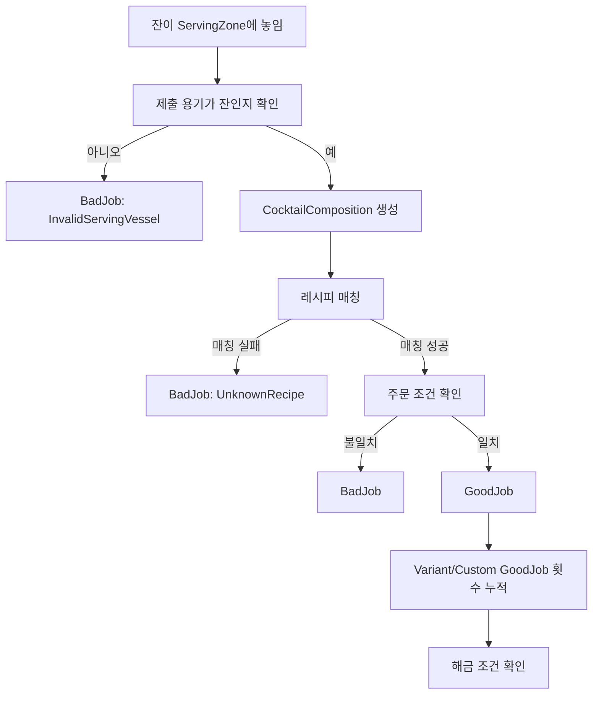
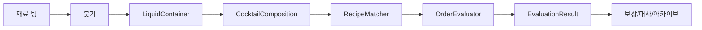

# 액체 메카닉 및 칵테일 평가 요구사항

문서 버전: v1  
작성 기준일: 2026-06-29  
대상 프로젝트: 슬런챠 Unity 프로젝트

---

## 1. 문서 목적

이 문서는 바텐딩 파트의 액체 메카닉, 칵테일 제조, 주문, 평가, 레시피 아카이빙, 기획 데이터 관리 요구사항을 정리한다.

핵심 방향은 다음과 같다.

- 액체의 시각적 표현과 물리적 연출은 기존 구현을 최대한 활용한다.
- 칵테일 평가는 물리 상태를 직접 판정하지 않고, 제조 결과를 요약한 데이터인 `CocktailComposition`을 기준으로 수행한다.
- 평가는 점수제가 아니라 `GoodJob` 또는 `BadJob` 판정이다.
- 레시피, 재료, 주문, 평가 규칙은 기획자가 에셋 또는 표 형태로 관리할 수 있어야 한다.
- 공식 레시피, 변형 레시피, 수제 레시피, 에피소드 전용 레시피는 같은 평가 로직으로 처리하되, 공개/아카이빙 규칙만 다르게 둔다.

---

## 2. 용어 정의

| 용어 | 정의 |
|---|---|
| 재료 | 술, 주스, 시럽 등 칵테일에 투입되는 액체 데이터 |
| 액체 입자 | 기존 액체 메카닉에서 사용하는 시각적/물리적 단위 |
| 용기 | 액체를 담을 수 있는 도구. 비커, 잔, 지거 등이 해당 |
| 잔 | 손님에게 제출 가능한 최종 용기. `Glass` 또는 `잔` 속성을 가진 도구 |
| 레시피 | 특정 칵테일을 정의하는 재료, 용량, 잔, 기법, 맛, 분위기 데이터 |
| 주문 | 손님이 요구하는 조건. 레시피 직접 주문, 맛 주문, 분위기 주문 등을 포함 |
| 기법 | Build, Stir, Shake, DryShake 등 제조 방식 |
| 섞임 상태 | Mixed, Layered, Any 등 완성물의 혼합 상태 |
| GoodJob | 제출물이 주문 요구를 충족한 결과 |
| BadJob | 제출물이 주문 요구를 충족하지 못한 결과 |
| 공식 레시피북 | 정식 레시피가 기록되는 책 |
| 비공식 레시피북 | 변형/수제 레시피가 해금 후 기록되는 책 |

---

## 3. 전체 설계 원칙

### 3.1 액체 표현과 평가의 분리

액체는 게임 화면에서 퍼지고, 층을 만들고, 섞이는 방식으로 표현되어야 한다. 하지만 최종 평가는 모든 입자 상태를 직접 분석하지 않는다.

평가에 필요한 정보는 제조 과정에서 별도로 누적한다.

예시:

- 어떤 재료가 몇 ml 들어갔는가
- 어떤 잔에 담겼는가
- 어떤 도구가 사용되었는가
- 어떤 기법이 감지되었는가
- 막대로 몇 초 이상 저었는가
- 셰이커를 사용했는가
- 최종 알코올 도수는 얼마인가
- 맛 비율은 어떻게 계산되는가

이 정보들을 모은 런타임 결과 데이터가 `CocktailComposition`이다.

### 3.2 레시피 우선 판정

평가는 다음 원칙을 따른다.

1. 제출물이 이미 존재하는 레시피 중 하나에 대응되는지 확인한다.
2. 대응되는 레시피가 없다면 `BadJob`이다.
3. 대응되는 레시피가 있다면, 그 레시피가 손님 주문의 요구와 일치하는지 확인한다.
4. 일치하면 `GoodJob`, 일치하지 않으면 `BadJob`이다.

즉, 플레이어가 어떤 칵테일을 만들었는지 먼저 확정하고, 그 칵테일이 손님이 원한 칵테일인지 나중에 확인한다.

### 3.3 평가 결과는 점수가 아니다

v1 평가 결과는 점수, 별점, 퍼센트 등급이 아니다.

기본 결과는 다음 둘 중 하나다.

- `GoodJob`
- `BadJob`

다만 디버그, 피드백, 기획 검증을 위해 실패 사유는 상세히 남긴다.

예시:

```json
{
  "result": "BadJob",
  "recognizedRecipeId": "godlord",
  "requestedRecipeId": "godlady",
  "failedReasons": [
    "RequestedRecipeMismatch"
  ]
}
```

---

## 4. 액체 메카닉 요구사항

### 4.1 기본 액체 동작

액체는 다음 표현을 지원해야 한다.

- 용기 안에 담김
- 다른 용기로 이동
- 용기 밖으로 흘러넘침
- 표면에서 확산
- 다른 액체와 접촉
- 밀도 차이에 따른 층 생성
- 막대, 바스푼, 셰이커 등 도구에 의한 섞임

### 4.2 기존 구현 활용

기존 프로젝트의 액체 구현을 최대한 활용한다.

활용 대상 예시:

- Metaball 기반 액체 시각화
- 액체 입자 풀링
- 액체 입자 간 색상/속성 반응
- 병, 비커, 잔의 기울이기 조작
- 충돌 기반 액체 이동

단, 기존 액체 구현이 평가에 필요한 의미 데이터를 모두 제공하지 못하는 경우, 평가용 데이터는 별도 컴포넌트에서 누적한다.

### 4.3 밀도와 층

재료는 `density` 값을 가진다.

밀도는 다음에 사용한다.

- 시각적 층 표현
- `Layered` 상태 유지 여부 판단
- 섞기 전후 상태 변화 표현

레이어링이 필요한 레시피 또는 주문은 `mixingRequirement = Layered`를 사용한다.

### 4.4 섞임 판정

섞임 상태는 다음 값 중 하나로 관리한다.

| 상태 | 의미 |
|---|---|
| Any | 섞임 여부를 평가하지 않음 |
| Mixed | 균일하게 섞인 상태가 필요함 |
| Layered | 층이 유지된 상태가 필요함 |
| Unmixed | 의도적으로 섞지 않은 상태가 필요함 |

막대 또는 바스푼으로 액체를 3초 이상 저으면 `Mixed` 상태로 판정한다.

기본값:

| 항목 | 값 |
|---|---:|
| 최소 Stir 시간 | 3초 |
| 용량 허용 오차 | 5% |
| 1 shot | 30ml |

---

## 5. 바텐딩 조작 요구사항

### 5.1 바 테이블

바 테이블은 6개 슬롯을 가진다.

슬롯 규칙:

- 각 슬롯에는 하나의 오브젝트만 놓을 수 있다.
- 슬롯 위 오브젝트는 언제든 다시 집을 수 있다.
- 오른쪽 술장에서 선택한 재료는 테이블 오른쪽 슬롯부터 배치된다.
- 아래 도구함에서 선택한 도구와 잔은 테이블 왼쪽 슬롯부터 배치된다.

### 5.2 오브젝트 배치 방식

선반 또는 도구함에서 테이블로 옮기는 방식은 드래그가 아니라 1클릭 즉시 이동이다.

테이블 위에 올라온 오브젝트는 다음 조작을 지원한다.

| 조작 | 입력 |
|---|---|
| 드래그 시작/종료 | 좌클릭 토글 |
| 기울이기 | 우클릭 유지 |
| 왼쪽으로 기울이기 | 우클릭 유지 + 마우스 위 이동 |
| 오른쪽으로 기울이기 | 우클릭 유지 + 마우스 아래 이동 |

### 5.3 도구별 동작

| 도구 | 요구 동작 |
|---|---|
| 비커 | 액체를 담고, 섞고, 다른 용기에 붓거나 흘릴 수 있다 |
| 잔 | 최종 제출 용기이며, 액체를 담고, 비커로 되붓거나 흘릴 수 있다 |
| 셰이커 캡 | 비커 위에 올리면 자동 결합되며, 결합 후 흔들어도 새지 않는다 |
| 셰이커 뚜껑 | 캡과 함께 사용되며 스트레이너 역할을 한다 |
| 바스푼 | 액체에 넣고 좌우로 움직여 Stir 판정을 만든다 |
| 재료 병 | 기울여 비커, 잔, 지거에 부을 수 있다 |
| 지거 | 재료를 계량한 뒤 다른 용기에 옮길 수 있다 |

---

## 6. 제조 기법 요구사항

### 6.1 지원 기법

| 기법 | 감지 조건 |
|---|---|
| Build | 잔에 직접 붓고 별도 혼합 도구를 사용하지 않음 |
| Stir | 바스푼 또는 막대로 3초 이상 저음 |
| Shake | 셰이커 캡/뚜껑을 결합한 상태로 흔듦 |
| DryShake | 얼음 없이 셰이킹 |

### 6.2 기법 판정 원칙

- 기법은 사용 도구와 행동 기록으로 감지한다.
- 레시피는 요구 기법을 가진다.
- 주문은 레시피의 기본 기법을 변경할 수 있다.
- 여러 기법을 사용한 경우 v1에서는 `BadJob` 사유로 처리한다.
- 여러 기법 사용을 허용하는 특수 주문은 향후 확장으로 둔다.

실패 사유 예시:

```text
ExtraTechniqueUsed
WrongTechnique
MissingTechnique
```

---

## 7. 재료 데이터 요구사항

재료는 `IngredientData`로 관리한다.

### 7.1 필수 필드

| 필드 | 타입 | 설명 |
|---|---|---|
| ingredientId | string | 내부 식별자 |
| displayName | string | 게임 내 표시 이름 |
| originalName | string | 원형 또는 모티브 이름 |
| tasteTag | TasteTag | 맛 |
| abvPercent | float | 알코올 도수 |
| density | float | 밀도 |
| color | Color | 액체 색상 |
| category | IngredientCategory | 재료 카테고리 |
| ingredientType | IngredientType | 세부 타입 |
| bottleVolumeMl | float | 병 용량 |
| price | int | 구매 가격 |

### 7.2 맛 태그

맛은 기획자가 드롭다운으로 선택한다.

| 태그 | 설명 |
|---|---|
| 달콤함 | 단맛 |
| 쌉쌀함 | 쓴맛 또는 위스키 계열 쌉쌀함 |
| 새콤함 | 산미 |
| 새콤달콤함 | 산미와 단맛이 함께 있는 맛 |
| 달큰함 | 리큐르 계열의 무거운 단맛 |
| 무맛 | 보드카처럼 맛이 강하지 않은 재료 |

`무맛` 처리 규칙:

- 여러 맛이 있는 칵테일에서는 `무맛`을 레시피 맛으로 아카이빙하지 않는다.
- 완성 칵테일의 유일한 맛이 `무맛`인 경우에만 `무맛`을 기록한다.

### 7.3 초기 재료 데이터

| ID 예시 | 표시 이름 | 원형 | 맛 | ABV | 카테고리 | 타입 | 용량 | 가격 |
|---|---|---|---|---:|---|---|---:|---:|
| tropical_juice | 열대 주스 | 파인애플 주스 | 새콤달콤함 | 0 | NonAlcohol | FruitJuice | 1000ml | 2000 |
| silcheong | 실청 | 설탕 시럽 | 달콤함 | 0 | Syrup | SugarSyrup | 300ml | 2000 |
| synthetic_lemon | 합성 레몬 | 레몬즙 | 새콤함 | 0 | Syrup | FruitSyrup | 300ml | 2000 |
| nanangna | 나낭나 | 말리부 | 달콤함 | 20 | Liquor | FruitLiquor | 700ml | 2000 |
| cotton | 코튼 | 아마레토 | 달큰함 | 20 | Liquor | NutsLiquor | 700ml | 2000 |
| hectare | 헥타르 | 스윗 베르못 | 달큰함 | 15 | Liquor | Vermouth | 700ml | 2000 |
| bless | 블레스 | 캄파리 | 달큰함 | 25 | Liquor | Vermouth | 700ml | 2000 |
| breeze_vodka | 브리즈 보드카 | 보드카 | 무맛 | 40 | Spirit | Vodka | 700ml | 2000 |
| lance_whisky | 란스 위스키 | 스카치 위스키 | 쌉쌀함 | 40 | Spirit | Whisky | 700ml | 2000 |

---

## 8. 레시피 데이터 요구사항

레시피는 `RecipeData`로 관리한다.

### 8.1 필수 필드

| 필드 | 타입 | 설명 |
|---|---|---|
| recipeId | string | 내부 식별자 |
| displayName | string | 공개 후 이름 |
| hiddenName | string | 공개 전 이름 또는 손님이 부르는 임시 표현 |
| recipeType | RecipeType | Official, Variant, Custom, EpisodeOnly |
| archiveBookType | ArchiveBookType | OfficialBook, UnofficialBook, None |
| ingredients | RecipeIngredient[] | 재료와 요구 용량 |
| requiredGlassType | GlassType | 요구 잔 |
| requiredTechnique | TechniqueType | 요구 기법 |
| mixingRequirement | MixingRequirement | 섞임 요구 |
| tasteTags | TasteTag[] | 레시피 맛 |
| moodTags | MoodTag[] | 레시피 분위기 |
| iceRequirement | IceRequirement | 얼음 요구. v1 평가는 비활성 가능 |
| tolerancePercent | float | 용량 허용 오차. 기본 5 |
| revealAfterGoodJobCount | int | 해금에 필요한 GoodJob 횟수 |
| beforeRevealOrderLines | string[] | 공개 전 주문 대사 |
| afterRevealOrderLines | string[] | 공개 후 주문 대사 |

### 8.2 레시피 재료 행

```csharp
RecipeIngredient
{
    string ingredientId;
    float requiredVolumeMl;
}
```

기획자는 `ml` 또는 `shot` 기준으로 입력할 수 있어야 한다.

내부 저장과 평가는 `ml`로 통일한다.

```text
1 shot = 30ml
```

### 8.3 분위기 태그

분위기는 재료가 아니라 레시피에 귀속된다.

| 태그 | 설명 |
|---|---|
| 청량한 | 시원하고 산뜻한 분위기 |
| 고급스러운 | 묵직하고 정제된 분위기 |
| 포근한 | 부드럽고 안정적인 분위기 |
| 화려한 | 색감이나 맛 구성이 눈에 띄는 분위기 |
| 깔끔한 | 단순하고 깨끗한 분위기 |

### 8.4 레시피 타입

| 타입 | 설명 |
|---|---|
| Official | 공식 레시피북에 기록되는 정식 레시피 |
| Variant | 공식 레시피와 동일한 판정 로직을 쓰지만 공식 레시피북에는 기록되지 않는 변형 레시피 |
| Custom | 손님이 레시피북에 없는 제조법을 알려주는 수제 레시피 |
| EpisodeOnly | 에피소드 시퀀스에서 사용하는 일회성 레시피 |

### 8.5 아카이브 규칙

| 타입 | 기본 아카이브 | 해금 조건 | 해금 후 변화 |
|---|---|---:|---|
| Official | 공식 레시피북 | 기본 공개 또는 별도 조건 | 공식 이름 표시 |
| Variant | 비공식 레시피북 | 5회 GoodJob | 이름 공개, 주문 대사 변경 |
| Custom | 비공식 레시피북 | 1회 GoodJob | 이름 공개, 주문 대사 변경 |
| EpisodeOnly | 없음 | 없음 | 에피소드 내부에서만 사용 |

Variant 규칙:

- 로직상 공식 레시피와 동일하게 평가한다.
- 공식 레시피북에는 기록하지 않는다.
- 미리 정해진 이름이 존재한다.
- 5번 GoodJob 서빙 후 해금된다.
- 해금 후 비공식 레시피북에 아카이빙된다.
- 해금 후 이름이 공개된다.
- 해금 후 주문 대사가 변경된다.

Custom 규칙:

- 로직상 공식 레시피와 동일하게 평가한다.
- 손님이 레시피북에 존재하지 않는 레시피를 알려주며 주문한다.
- 미리 정해진 이름이 존재한다.
- 1번 GoodJob 서빙 후 해금된다.
- 해금 후 비공식 레시피북에 아카이빙된다.
- 해금 후 이름이 공개된다.
- 해금 후 주문 대사가 변경된다.

---

## 9. 초기 레시피 데이터

PDF 기획안 기준 초기 레시피는 다음을 포함한다.

### 9.1 칵테일 레시피

| ID 예시 | 표시 이름 | 모티브 | 재료 | 기법 | 잔 | 분위기 | 맛 |
|---|---|---|---|---|---|---|---|
| lance_sour | 란스 샤워 | 위스키 샤워 | 실청 15ml, 합성 레몬 15ml, 란스 위스키 30ml | DryShake | 락 글라스 | 청량한 | 달콤함, 새콤함, 쌉쌀함 |
| cotton_sour | 코튼 샤워 | 아마레트 샤워 | 코튼 30ml, 란스 위스키 30ml | DryShake | 락 글라스 | 포근한 | 달큰함, 쌉쌀함 |
| godlady | 갓레이디 | 갓마더 | 코튼 30ml, 브리즈 보드카 30ml | Stir | 락 글라스 | 고급스러운 | 달콤함 |
| godlord | 갓로드 | 갓파더 | 코튼 30ml, 란스 위스키 30ml | Shake | 락 글라스 | 고급스러운 | 달큰함, 쌉쌀함 |
| sadie | 세이디 | 불바디 | 헥타르 30ml, 블레스 30ml, 란스 위스키 30ml | Stir | 락 글라스 | 고급스러운 | 달큰함, 쌉쌀함 |
| midsummer_nanagna | 한여름의 나낭나 | 말리부 파인애플 | 나낭나 30ml, 열대 주스 90ml | Stir | 허리케인 글라스 | 화려한, 청량한 | 달콤함, 새콤달콤함 |
| midsummer_juice | 한여름의 주스 | 무알콜 주스 | 실청 15ml, 합성 레몬 15ml, 열대 주스 90ml | Stir | 허리케인 글라스 | 포근한 | 달콤함, 새콤함, 새콤달콤함 |

### 9.2 니트/온더락 레시피

| ID 예시 | 표시 이름 | 모티브 | 재료 | 기법 | 잔 | 얼음 | 분위기 | 맛 |
|---|---|---|---|---|---|---|---|---|
| lance_neat | 란스 니트 | 스카치 니트 | 란스 위스키 30ml | Build | 락 글라스 | 없음 | 고급스러운 | 쌉쌀함 |
| lance_on_the_rock | 란스 온더락 | 스카치 온더락 | 란스 위스키 30ml | Build | 락 글라스 | 있음 | 고급스러운 | 쌉쌀함 |
| breeze_neat | 브리즈 니트 | 보드카 니트 | 브리즈 보드카 30ml | Build | 락 글라스 | 없음 | 깔끔한 | 무맛 |
| breeze_on_the_rock | 브리즈 온더락 | 보드카 온더락 | 브리즈 보드카 30ml | Build | 락 글라스 | 있음 | 깔끔한 | 무맛 |

주의:

- 얼음 데이터는 레시피에는 기록한다.
- v1 평가에서 얼음을 제외하기로 한 경우 `evaluateIceAndTemperature = false`로 둔다.

---

## 10. 주문 데이터 요구사항

주문은 `OrderData`로 관리한다.

### 10.1 필수 필드

| 필드 | 타입 | 설명 |
|---|---|---|
| orderId | string | 주문 식별자 |
| orderType | OrderType | 주문 타입 |
| characterId | string | 손님 식별자 |
| dialogueLines | string[] | 주문 대사 |
| requestedRecipeId | string | 요구 레시피 |
| overrideTechnique | TechniqueType? | 변경 요구 기법 |
| overrideGlassType | GlassType? | 변경 요구 잔 |
| requiredTasteTags | TasteRequirement[] | 맛 요구 |
| requiredMoodTags | MoodRequirement[] | 분위기 요구 |
| requiredAbvRange | Range? | 도수 요구 |
| oneTimeEpisodeAnswer | bool | 에피소드 전용 정답 여부 |
| persistConditionMode | OrderConditionMode | 유지/변경 조건 구분 |

### 10.2 주문 타입

| 주문 타입 | 예시 대사 | 평가 방식 |
|---|---|---|
| RecipeOrder | 오늘은 갓파더가 좋겠어 | 특정 레시피를 요구한다 |
| ModifiedRecipeOrder | 갓파더가 좋겠어. 스터 말고 셰이킹해줘 | 레시피 정체성은 유지하되 일부 조건을 변경한다 |
| TasteOrder | 새콤달콤한 게 마시고 싶어 | 요구 맛이 포함된 레시피를 요구한다 |
| MoodOrder | 포근한 칵테일이 마시고 싶군 | 요구 분위기가 강한 레시피를 요구한다 |
| VariantRecipeOrder | 위스키 말고 브랜디로 해줄 수 있나? | Variant 레시피를 요구한다 |
| CustomRecipeOrder | 위스키 한 샷, 레몬 한 샷, 와인 한 샷 | Custom 레시피를 손님이 직접 설명한다 |
| EpisodeOrder | 빨리 아무 술이나 줘 봐. 도수 높은 거로 | 에피소드가 지정한 조건을 요구한다 |

### 10.3 유지되는 조건과 변경되는 조건

주문 조건은 두 종류로 구분한다.

| 구분 | 설명 | 예시 |
|---|---|---|
| 유지 조건 | 원래 레시피의 정체성을 유지해야 하는 조건 | 갓파더를 주문했으므로 갓파더 계열이어야 함 |
| 변경 조건 | 손님이 명시적으로 바꾸라고 한 조건 | 스터 대신 셰이킹, 다른 잔 사용 |

예시:

```text
"오늘은 갓파더가 좋겠어. 스터 말고 셰이킹해줘."
```

이 주문은 다음처럼 해석한다.

- 유지 조건: 갓파더 계열 레시피여야 한다.
- 변경 조건: 공식 기법이 Stir였더라도 이번 주문에서는 Shake를 요구한다.

---

## 11. 완성 및 제출 요구사항

### 11.1 완성 용기

완성 용기는 `잔` 속성이 붙은 도구여야 한다.

예시 속성:

```csharp
ToolTag.Glass
```

또는:

```csharp
bool isServingGlass;
```

### 11.2 완성 시점

완성 시점은 손님에게 내는 영역에 `잔`을 놓았을 때다.

요구 컴포넌트 예시:

```text
ServingZone
```

`ServingZone`은 다음 조건을 확인한다.

1. 놓인 오브젝트가 잔인가
2. 잔 안에 액체가 있는가
3. 현재 주문이 존재하는가
4. 평가 가능한 상태인가

조건을 만족하면 즉시 평가를 실행한다.

### 11.3 제출 후 처리

제출 후 처리 순서:

1. 평가 실행
2. `GoodJob` 또는 `BadJob` 결과 생성
3. 보상 지급
4. 제출한 잔 제거
5. 비커와 잔 안의 액체 정리
6. 병의 남은 재료량 유지
7. 테이블 위 도구와 재료 배치 유지
8. 다음 손님 등장

---

## 12. 평가 데이터 요구사항

### 12.1 CocktailComposition

`CocktailComposition`은 제출 시점의 완성물을 나타내는 런타임 데이터다.

필드 예시:

```csharp
public sealed class CocktailComposition
{
    public string glassType;
    public List<CompositionIngredient> ingredients;
    public List<TechniqueType> usedTechniques;
    public MixingState mixingState;
    public float totalVolumeMl;
    public float calculatedAbvPercent;
    public Dictionary<TasteTag, float> tasteProfile;
    public List<MoodTag> moodTags;
    public bool hasIce;
    public float? temperature;
}
```

### 12.2 CompositionIngredient

```csharp
public sealed class CompositionIngredient
{
    public string ingredientId;
    public float volumeMl;
}
```

### 12.3 EvaluationSettings

평가 규칙은 `EvaluationSettings` 또는 `EvaluationRuleData`로 관리한다.

| 필드 | 기본값 | 설명 |
|---|---:|---|
| recipeTolerancePercent | 5 | 재료 용량 허용 오차 |
| shotMl | 30 | 1샷 기준 |
| stirRequiredSeconds | 3 | Stir 판정 최소 시간 |
| failOnExtraTechnique | true | 여러 기법 사용 시 BadJob 처리 |
| requireGlassMatch | true | 잔 일치 여부 평가 |
| evaluateIceAndTemperature | false | v1에서는 얼음/온도 평가 비활성 가능 |
| allowUnknownRecipe | false | 레시피 미대응 결과물 허용 여부 |

---

## 13. 평가 로직

### 13.1 평가 순서



### 13.2 레시피 매칭 조건

제출물은 다음 조건을 모두 만족해야 해당 레시피로 인정된다.

| 조건 | 설명 |
|---|---|
| 재료 일치 | 레시피에 있는 재료가 제출물에 포함되어야 함 |
| 용량 일치 | 각 재료 용량이 허용 오차 이내여야 함 |
| 추가 재료 없음 | 레시피에 없는 재료가 들어가면 실패 |
| 잔 일치 | 요구 잔과 제출 잔이 같아야 함 |
| 기법 일치 | 요구 기법과 감지 기법이 같아야 함 |
| 섞임 상태 일치 | Mixed, Layered 등 요구 상태를 만족해야 함 |

### 13.3 허용 오차

기본 허용 오차는 5%다.

예시:

| 요구량 | 허용 범위 |
|---:|---:|
| 15ml | 14.25ml ~ 15.75ml |
| 30ml | 28.5ml ~ 31.5ml |
| 90ml | 85.5ml ~ 94.5ml |

판정식:

```text
abs(actualMl - requiredMl) <= requiredMl * tolerancePercent / 100
```

### 13.4 알코올 도수 계산

최종 알코올 도수는 재료별 용량과 ABV를 기준으로 계산한다.

```text
최종 ABV = Σ(재료 용량 ml × 재료 ABV) / 총 액체 용량 ml
```

예시:

```text
코튼 30ml, ABV 20
란스 위스키 30ml, ABV 40

최종 ABV = (30 × 20 + 30 × 40) / 60
         = 30
```

### 13.5 맛 비율 계산

맛 비율은 해당 맛을 가진 재료 용량의 합을 전체 용량으로 나눈 값이다.

```text
맛 비율 = 해당 맛 재료 용량 합 / 전체 용량
```

예시:

```text
코튼 30ml: 달큰함
란스 위스키 30ml: 쌉쌀함

달큰함 = 30 / 60 = 0.5
쌉쌀함 = 30 / 60 = 0.5
```

출력 예시:

```json
{
  "달큰함": 0.5,
  "쌉쌀함": 0.5
}
```

### 13.6 분위기 판정

분위기는 재료가 아니라 레시피에 귀속된다.

따라서 분위기 주문은 제출물에서 매칭된 레시피의 `moodTags`를 기준으로 판정한다.

예시:

```text
주문: 포근한 칵테일이 마시고 싶군.
제출물 매칭 레시피: 코튼 샤워
코튼 샤워 분위기: 포근한
결과: GoodJob
```

### 13.7 실패 사유

평가 결과에는 실패 사유를 남긴다.

| 실패 사유 | 의미 |
|---|---|
| InvalidServingVessel | 제출 용기가 잔이 아님 |
| EmptyGlass | 잔에 액체가 없음 |
| UnknownRecipe | 어떤 레시피와도 매칭되지 않음 |
| WrongIngredient | 재료 구성이 다름 |
| WrongIngredientRatio | 재료 용량 또는 비율이 다름 |
| ExtraIngredient | 레시피에 없는 재료가 들어감 |
| WrongGlass | 사용 잔이 다름 |
| WrongTechnique | 사용 기법이 다름 |
| ExtraTechniqueUsed | 여러 기법을 사용함 |
| WrongMixingState | 섞임 상태가 다름 |
| RequestedRecipeMismatch | 주문자가 요구한 레시피와 다름 |
| TasteRequirementNotMet | 요구 맛을 만족하지 못함 |
| MoodRequirementNotMet | 요구 분위기를 만족하지 못함 |
| AbvRequirementNotMet | 요구 도수를 만족하지 못함 |
| IceRequirementNotMet | 얼음 조건을 만족하지 못함 |

---

## 14. 평가 결과 데이터

평가 결과는 `EvaluationResult`로 반환한다.

```csharp
public sealed class EvaluationResult
{
    public EvaluationGrade grade;
    public string recognizedRecipeId;
    public string requestedRecipeId;
    public bool recipeMatched;
    public bool orderFulfilled;
    public List<EvaluationFailReason> failedReasons;
    public float calculatedAbvPercent;
    public Dictionary<TasteTag, float> tasteProfile;
    public bool recipeRevealed;
    public ArchiveBookType archivedTo;
}
```

JSON 예시:

```json
{
  "grade": "GoodJob",
  "recognizedRecipeId": "godlord",
  "requestedRecipeId": "godlord",
  "recipeMatched": true,
  "orderFulfilled": true,
  "calculatedAbvPercent": 30.0,
  "tasteProfile": {
    "달큰함": 0.5,
    "쌉쌀함": 0.5
  },
  "recipeRevealed": false,
  "archivedTo": "None",
  "failedReasons": []
}
```

---

## 15. 레시피 해금 및 아카이빙

### 15.1 GoodJob 누적

Variant 또는 Custom 레시피가 GoodJob으로 제출되면 해당 레시피의 성공 횟수를 누적한다.

```text
recipeGoodJobCount[recipeId] += 1
```

### 15.2 해금 조건

해금 조건을 만족하면 다음 처리를 한다.

1. 레시피 공개 상태를 `revealed = true`로 변경한다.
2. 공개 이름을 표시한다.
3. 주문 대사를 공개 후 대사로 변경한다.
4. 지정된 레시피북에 아카이빙한다.

### 15.3 아카이브 대상

| 레시피 타입 | 아카이브 대상 |
|---|---|
| Official | 공식 레시피북 |
| Variant | 비공식 레시피북 |
| Custom | 비공식 레시피북 |
| EpisodeOnly | 없음 |

---

## 16. 얼음 및 온도 처리

PDF 기획안에는 얼음/온도 평가가 포함되어 있다. 그러나 현재 v1 기획에서는 얼음 평가를 우선 구현하지 않는다.

따라서 다음 방침을 따른다.

- 레시피 데이터에는 `iceRequirement`를 보유한다.
- 평가 설정에는 `evaluateIceAndTemperature` 플래그를 둔다.
- v1 기본값은 `false`다.
- 향후 얼음 평가를 활성화할 때 기존 레시피 데이터를 재사용한다.

온도 데이터는 향후 확장을 위해 다음 범위를 고려한다.

```text
온도 범위: -30 ~ 80
```

온도 평가는 얼음, 물, 액체 접촉, 시간 경과를 함께 고려해야 하므로 v1 범위에서는 제외한다.

---

## 17. 기획자 관리 요구사항

### 17.1 에셋화 대상

다음 데이터는 ScriptableObject 또는 CSV 연동 에셋으로 관리한다.

| 데이터 | 권장 에셋 |
|---|---|
| 재료 | IngredientData |
| 맛 태그 | TasteTagData 또는 enum |
| 분위기 태그 | MoodTagData 또는 enum |
| 잔 | GlassData |
| 도구 | ToolData |
| 레시피 | RecipeData |
| 주문 | OrderData |
| 평가 규칙 | EvaluationSettings |
| 레시피북 상태 | RecipeArchiveState |

### 17.2 기획자 편의 기능

기획자는 코드 수정 없이 다음 작업을 할 수 있어야 한다.

- 재료 추가/수정
- 재료 맛과 도수 설정
- 레시피 재료와 용량 설정
- 레시피 잔과 기법 설정
- 레시피 분위기 설정
- 주문 대사 작성
- 주문 타입 선택
- Variant/Custom 해금 조건 설정
- 레시피북 노출 여부 설정
- 평가 허용 오차 설정

### 17.3 입력 방식

문자열 직접 입력은 최소화한다.

권장 방식:

- 재료 선택: 드롭다운
- 맛 선택: 드롭다운 또는 체크박스
- 분위기 선택: 드롭다운 또는 체크박스
- 잔 선택: 드롭다운
- 기법 선택: 드롭다운
- 용량 입력: ml 숫자 입력 + shot 변환 입력
- 해금 횟수: 정수 입력

### 17.4 레시피 미리보기

레시피 편집 화면에는 다음 미리보기가 필요하다.

- 총 용량
- shot 환산
- 계산된 최종 ABV
- 맛 비율
- 분위기 태그
- 요구 잔
- 요구 기법
- 얼음 요구 여부
- 레시피북 노출 위치

### 17.5 데이터 검증

저장 전 또는 빌드 전 다음 오류를 검출한다.

| 검증 항목 | 오류 조건 |
|---|---|
| 재료 누락 | 레시피에 존재하지 않는 ingredientId가 있음 |
| 용량 오류 | 재료 용량이 0ml 이하 |
| 잔 누락 | requiredGlassType이 비어 있음 |
| 기법 누락 | requiredTechnique이 비어 있음 |
| 중복 레시피 | 같은 재료/용량/잔/기법 조합의 레시피가 둘 이상 존재 |
| 해금 조건 누락 | Variant/Custom인데 revealAfterGoodJobCount가 없음 |
| 주문 대상 누락 | RecipeOrder인데 requestedRecipeId가 없음 |
| 대사 누락 | 공개 전/공개 후 대사가 필요한데 비어 있음 |
| 맛 태그 오류 | 알 수 없는 맛 태그 사용 |
| 분위기 태그 오류 | 알 수 없는 분위기 태그 사용 |

---

## 18. 구현 권장 구조

### 18.1 런타임 주요 컴포넌트

| 컴포넌트 | 역할 |
|---|---|
| LiquidContainer | 용기 안 액체 구성 추적 |
| LiquidPortion | 특정 재료의 액체량 추적 |
| PourTracker | 붓기 행동과 용량 이동 기록 |
| TechniqueTracker | 사용 기법 기록 |
| MixingTracker | Stir 시간, Shake 여부, Layer 상태 기록 |
| ServingZone | 제출 감지 |
| CocktailComposer | CocktailComposition 생성 |
| RecipeMatcher | 제출물과 레시피 매칭 |
| OrderEvaluator | 매칭된 레시피와 주문 조건 비교 |
| RecipeArchiveManager | Variant/Custom 해금 및 아카이빙 처리 |

### 18.2 데이터 흐름



### 18.3 기존 액체 시스템과의 연결

기존 액체 입자는 다음 역할을 담당한다.

- 보이는 액체의 형태
- 흐름과 충돌
- 섞이는 연출
- 색상 혼합 표현

신규 평가 데이터는 다음 역할을 담당한다.

- 재료별 용량
- 재료별 도수
- 맛 비율
- 레시피 매칭
- 주문 평가
- 해금/아카이브

---

## 19. 수용 기준

### 19.1 액체 조작

- 재료 병을 기울이면 비커 또는 잔에 액체가 들어간다.
- 비커를 기울이면 잔에 액체를 옮길 수 있다.
- 액체가 담긴 잔을 ServingZone에 놓으면 평가가 실행된다.
- 막대 또는 바스푼으로 3초 이상 저으면 Stir로 기록된다.
- 셰이커를 사용하면 Shake 또는 DryShake로 기록된다.

### 19.2 레시피 평가

- 요구량 30ml인 재료는 28.5ml~31.5ml 범위에서 일치로 판정된다.
- 레시피에 없는 재료가 들어가면 BadJob이다.
- 요구 잔과 다른 잔을 사용하면 BadJob이다.
- 요구 기법과 다른 기법을 사용하면 BadJob이다.
- 여러 기법을 사용하면 BadJob이다.
- 존재하지 않는 레시피 조합이면 BadJob이다.

### 19.3 주문 평가

- 레시피 주문은 해당 레시피로 매칭되어야 GoodJob이다.
- 맛 주문은 매칭된 레시피 또는 완성물 맛 비율에 요구 맛이 포함되어야 GoodJob이다.
- 분위기 주문은 매칭된 레시피의 분위기가 요구 분위기와 일치해야 GoodJob이다.
- 에피소드 주문은 에피소드가 지정한 조건을 만족해야 GoodJob이다.

### 19.4 아카이빙

- Variant 레시피는 5회 GoodJob 후 비공식 레시피북에 기록된다.
- Custom 레시피는 1회 GoodJob 후 비공식 레시피북에 기록된다.
- 해금 전에는 숨겨진 이름 또는 우회 대사를 사용한다.
- 해금 후에는 공개 이름과 변경된 주문 대사를 사용한다.

---

## 20. v1 제외 범위

다음 항목은 v1에서 구현하지 않거나 비활성화한다.

- 점수제 평가
- 세밀한 온도 계산
- 얼음의 물리적 녹음/희석 평가
- 여러 기법을 허용하는 복합 제조 주문
- 레시피에 없는 즉흥 칵테일의 자동 생성
- 물리 입자 상태만으로 레시피를 역산하는 방식

---

## 21. 향후 확장 후보

향후 다음 기능을 확장할 수 있다.

- 얼음 개수와 온도 변화 평가
- 시간 경과에 따른 희석
- 흔드는 강도에 따른 Shake 품질
- 층의 선명도 평가
- 맛 강도 0~100 수치화
- 분위기 강도 수치화
- 레시피북 UI에서 힌트 단계 표시
- CSV/Google Sheets 기반 대량 편집
- 레시피 평가 시뮬레이터

---

## 22. 액체 입자 1ml 및 Payload 이동 규칙

비커에서 잔으로 따르는 행위까지 자연스럽게 처리하기 위해 v1에서는 다음 규칙을 추가한다.

핵심 원칙:

- 액체 입자 1개는 기본적으로 `1ml`로 취급한다.
- 액체 입자는 화면에 보이는 물리/시각 단위이면서, 이동 중인 `LiquidPayload`를 함께 가진다.
- 최종 평가는 입자 개수를 직접 세지 않고, 잔/비커의 `LiquidContainer`에 기록된 데이터를 기준으로 한다.
- 입자는 이동 연출과 컨테이너 간 데이터 전달을 연결하는 매개체로 사용한다.

### 22.1 LiquidPayload

`LiquidPayload`는 액체 입자 하나가 운반하는 의미 데이터다.

```csharp
public sealed class LiquidPayload
{
    public float volumeMl;
    public List<LiquidPortion> portions;
}
```

예시 1: 병에서 바로 나온 위스키 1ml

```json
{
  "volumeMl": 1.0,
  "portions": [
    { "ingredientId": "lance_whisky", "volumeMl": 1.0 }
  ]
}
```

예시 2: 비커 안에서 이미 섞인 액체 1ml

```json
{
  "volumeMl": 1.0,
  "portions": [
    { "ingredientId": "lance_whisky", "volumeMl": 0.5 },
    { "ingredientId": "cotton", "volumeMl": 0.5 }
  ]
}
```

### 22.2 병에서 비커/잔으로 붓기

병은 단일 재료를 가진다.

병을 기울여 액체 입자 1개를 생성하면 다음 처리를 한다.

1. 병의 남은 용량을 1ml 줄인다.
2. 해당 재료 1ml를 가진 `LiquidPayload`를 만든다.
3. 액체 입자에 `LiquidPayload`를 붙인다.
4. 액체 입자를 병 입구 위치에서 생성한다.
5. 입자가 비커 또는 잔의 입구 트리거에 들어가면 대상 `LiquidContainer`에 payload를 더한다.

### 22.3 비커에서 잔으로 붓기

비커에서 잔으로 따르는 경우에는 비커의 `LiquidContainer`가 출발점이 된다.

처리 순서:

1. 비커가 일정 각도 이상 기울어진다.
2. `PourTracker`가 비커의 `LiquidContainer.TryPourOut(1ml)`을 호출한다.
3. 비커의 `LiquidContainer`에서 1ml만큼 내용물이 차감된다.
4. 차감된 1ml는 `LiquidPayload`가 된다.
5. 액체 입자가 생성되고 payload를 운반한다.
6. 입자가 잔의 입구 트리거에 들어가면 잔의 `LiquidContainer`에 payload가 추가된다.
7. 입자가 바닥이나 화면 밖으로 나가면 해당 1ml는 손실된다.

이 방식에서는 출발 컨테이너에서 먼저 용량을 차감한다. 따라서 바닥에 흘린 액체는 자연스럽게 손실로 처리된다.

### 22.4 섞인 상태와 층 상태의 PourOut 규칙

`LiquidContainer.TryPourOut(1ml)`은 현재 섞임 상태에 따라 다른 payload를 만든다.

| 상태 | PourOut 규칙 |
|---|---|
| Mixed | 전체 재료 비율대로 1ml를 나눈다 |
| Layered | 출구에 가까운 층 또는 상층부터 1ml를 뺀다 |
| Unmixed | 내부 순서 또는 층 순서를 유지하며 먼저 닿는 재료부터 뺀다 |
| Any | 현재 컨테이너 상태에 따른 기본 규칙을 사용한다 |

예시: Mixed 상태

```text
비커 내용물:
- 란스 위스키 30ml
- 코튼 30ml

PourOut(1ml):
- 란스 위스키 0.5ml
- 코튼 0.5ml
```

예시: Layered 상태

```text
비커 내용물:
- 상층: 실청 15ml
- 하층: 란스 위스키 30ml

PourOut(1ml):
- 현재 출구에 가까운 층에서 1ml
```

### 22.5 LiquidParticleData

액체 입자에는 다음 데이터가 붙는다.

```csharp
public sealed class LiquidParticleData : MonoBehaviour
{
    public LiquidPayload payload;
    public bool hasBeenCollected;
    public LiquidContainer sourceContainer;
    public float emittedTime;
}
```

필수 규칙:

- 풀링에서 입자를 다시 꺼낼 때 payload와 수집 상태를 반드시 초기화한다.
- `hasBeenCollected == true`인 입자는 다시 컨테이너에 누적되지 않는다.
- `sourceContainer`는 같은 컨테이너에 즉시 재흡수되는 현상을 막는 데 사용한다.
- 액체 입자가 대상 컨테이너에 수집되면 시각 입자는 풀로 반환하거나 흡수 연출 후 제거한다.

### 22.6 LiquidReceiver

비커와 잔에는 입구 수집 영역인 `LiquidReceiver`를 둔다.

규칙:

- `LiquidReceiver`는 용기 본체 콜라이더와 별도의 Trigger로 둔다.
- 위치는 잔/비커의 입구 근처에 둔다.
- 판정 영역은 실제 입구보다 약간 넓게 잡아 플레이 감각을 부드럽게 한다.
- 액체 입자가 Trigger에 들어오면 `LiquidParticleData.payload`를 읽어 `LiquidContainer.AddPayload()`를 호출한다.
- 이미 수집된 입자는 무시한다.
- 같은 출발 컨테이너에서 방금 나온 입자가 즉시 다시 들어오는 경우는 짧은 시간 동안 무시할 수 있다.

### 22.7 평가 허용 오차와 1ml 단위

액체 입자 1개가 1ml이므로 실제 용량은 정수 ml 단위로 누적된다.

기본 허용 오차는 기존 요구사항대로 5%다. 다만 15ml처럼 소량 재료는 5%가 1ml보다 작기 때문에, 플레이 감각을 위해 v1에서는 다음 보정 규칙을 권장한다.

```text
실제 허용 오차 ml = max(요구량 × 0.05, 1ml)
```

예시:

| 요구량 | 5% | v1 권장 허용 오차 | 권장 허용 범위 |
|---:|---:|---:|---:|
| 15ml | 0.75ml | 1ml | 14ml ~ 16ml |
| 30ml | 1.5ml | 1.5ml | 28.5ml ~ 31.5ml |
| 90ml | 4.5ml | 4.5ml | 85.5ml ~ 94.5ml |

이 보정 규칙을 사용하지 않을 경우, 15ml 재료는 입자 단위상 사실상 15ml만 통과하게 된다.

