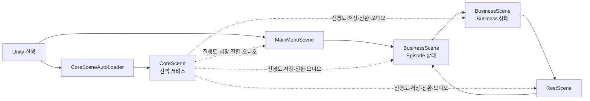
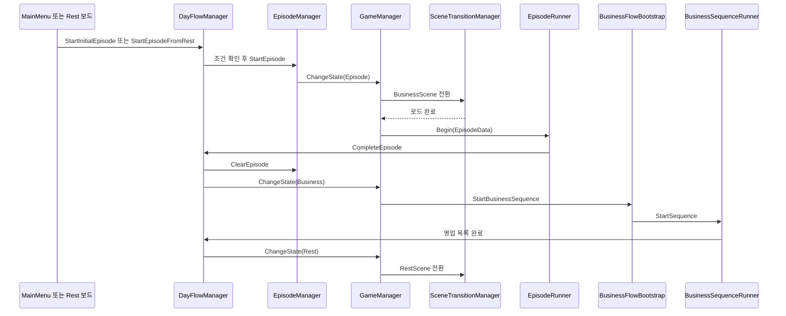
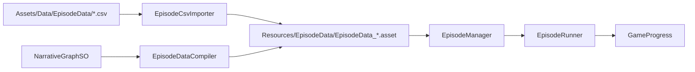
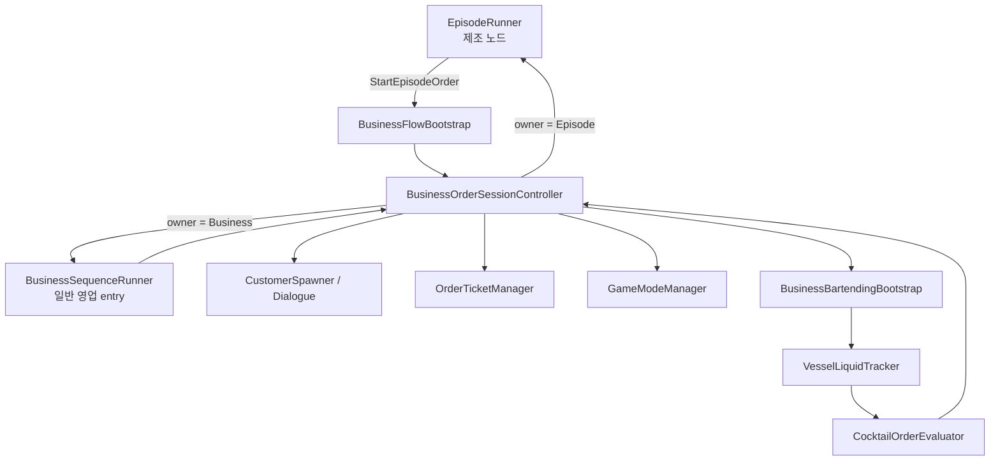
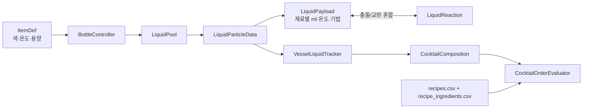
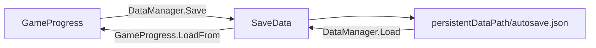

# Slainte 프로젝트 코드 이해 가이드

> 기준: 2026-08-09 현재 작업 공간, Unity `6000.3.5f2`
>
> 규모: C# 163개, 약 20,425행(물리 행 기준), 런타임 136개와 Editor 27개. 별도 `.asmdef`와 자동화 테스트 어셈블리는 없다.

이 문서는 163개 파일을 사전처럼 나열하지 않는다. 대신 게임이 시작되어 하루가 끝날 때까지 실제 호출 경로를 중심으로 시스템 경계와 데이터의 출처를 설명한다. 코드를 처음 읽을 때는 아래 순서대로 보면 된다.

1. 이 문서의 **큰 그림**, **네 가지 상태**, **하루 실행 흐름**을 읽는다.
2. `CoreScene`의 전역 서비스와 `BusinessScene`의 씬 전용 시스템을 구분한다.
3. 관심 기능에 맞춰 에피소드, 영업 주문, 바텐딩, 휴식 씬 중 하나의 호출 체인을 따라간다.
4. 실제 수정 전에는 **무엇을 바꾸려면 어디를 볼까**와 **현재 경로/구형 경로 구분**을 확인한다.

결함과 수정 우선순위는 [현재 코드 리뷰](code-review-2026-08-09.md)를 별도로 참고한다. 2026-08-05 문서는 당시 상태를 보존한 이력이며, 이 문서는 “어떻게 동작하는가”, 현재 코드 리뷰는 “무엇을 다시 확인해야 하는가”에 초점을 둔다.

## 1. 30초 큰 그림

Slainte는 다음 네 부분의 조합이다.

- `CoreScene`: 씬이 바뀌어도 남는 저장, 진행도, 에피소드 목록, 오디오, 씬 전환 서비스
- `BusinessScene`: 대화형 에피소드와 일반 영업이 공유하는 플레이 공간
- `RestScene`: 에피소드 보드, 상점, 현황 UI를 제공하는 휴식 공간
- 데이터 에셋: 에피소드 `ScriptableObject`, 캐릭터/손님/주문표 데이터, 칵테일 CSV, 아이템 에셋

가장 중요한 사실은 **Episode와 Business가 서로 다른 씬이 아니라 같은 `BusinessScene`의 서로 다른 실행 경로**라는 점이다. 두 경로는 캐릭터, 대화, 주문표, 바텐딩과 주문 판정 시스템을 공유한다.

## 2. 반드시 분리해서 볼 네 가지 상태

코드에는 이름이 비슷한 상태가 여러 층에 있다. 이들을 섞지 않으면 전체 구조가 빠르게 보인다.

| 범위 | 상태 타입 | 소유자 | 의미 |
|---|---|---|---|
| 게임 전체 | `GameState` | [`GameManager`](../Assets/CoreScene/Scripts/GameManager.cs) | `None`, `Episode`, `Business`, `Rest`. 어떤 서브 씬과 하루 단계가 활성인지 결정한다. |
| `BusinessScene` UI/입력 | `GameMode` | [`GameModeManager`](../Assets/Scripts/Core/GameModeManager.cs) | `OrderMode`, `EpisodeMode`, `CraftingMode`. 패널과 입력을 어떤 용도로 쓸지 결정한다. |
| 주문 한 건 | `BusinessOrderSessionState` | [`BusinessOrderSessionController`](../Assets/Scripts/Business/BusinessOrderSessionController.cs) | 주문 제시, 제작, 판정, 피드백, 완료의 진행 단계다. |
| 제작 도구 하나 | `BottleState`, `BeakerState`, `GlassState`, `StirringRodState` | 각 도구 Controller | 집기, 기울이기/회전, 복귀 같은 물리 상호작용 단계다. |

예를 들어 `GameState.Episode`인 동안에도 제조 노드에 들어가면 `GameMode`는 잠시 `CraftingMode`가 된다. 이때 병 하나는 동시에 `BottleState.Tilting`일 수 있다. 서로 다른 축이므로 모순이 아니다.

주문은 수락·거절 상태를 두지 않는다. 주문 대사가 닫히면 `PresentingOrder`에서 바로 `Crafting`으로 이동하며, 제출은 버튼이 아니라 잔을 전방 기준선 너머로 끄는 동작으로 발생한다.

## 3. 애플리케이션 시작과 객체 수명

### 3.1 부팅 순서

1. [`CoreSceneAutoLoader`](../Assets/CoreScene/Scripts/CoreSceneAutoLoader.cs)가 `BeforeSceneLoad` 시점에 `CoreScene`이 없으면 Additive로 로드한다.
2. `CoreScene`에 배치된 `GameManager`, `SceneTransitionManager`, `EpisodeManager`, `DataManager`, `AudioManager`가 초기화된다.
3. [`DataManager.Awake()`](../Assets/CoreScene/Scripts/DataManager.cs)가 `autosave.json`을 읽고 `GameProgress`에 복원한다.
4. [`EpisodeManager.Awake()`](../Assets/CoreScene/Scripts/EpisodeManager.cs)가 `Resources/EpisodeData`의 모든 `EpisodeData`를 메모리에 올린다.
5. 처음 연 서브 씬이 MainMenu, Business, Rest 중 무엇이든 Core 서비스는 뒤에서 유지된다.

### 3.2 두 종류의 Singleton

| 기반 | 수명 | 대표 객체 | 읽을 때 주의할 점 |
|---|---|---|---|
| [`MonoSingleton<T>`](../Assets/CoreScene/Scripts/MonoSingleton.cs) | `DontDestroyOnLoad` | `GameManager`, `EpisodeManager`, `DataManager`, `GameProgress`, `DayFlowManager`, `AudioManager`, `SceneTransitionManager` | 씬에 없으면 `Instance` 접근 시 새 GameObject를 만든다. 씬 배치 위치와 실제 런타임 생성 위치가 다를 수 있다. |
| [`SceneSingleton<T>`](../Assets/CoreScene/Scripts/SceneSingleton.cs) | 현재 씬에만 존재 | `GameModeManager`, `NotificationManager` | 씬의 직렬화 참조를 잡으므로 다음 씬까지 유지하면 안 된다. `BusinessScene`을 다시 열면 새 인스턴스가 생긴다. |

`DayFlowManager`는 현재 씬에 미리 배치되지 않아 첫 `Instance` 접근 때 생성된다. `GameProgress`도 저장 로드 과정에서 필요하면 자동 생성된다. 반면 `BusinessScene`에도 `GameProgress` 객체가 직렬화되어 있어, 이미 전역 인스턴스가 있으면 중복 객체 쪽이 `Awake()`에서 제거된다. 따라서 Hierarchy 배치만 보고 객체 수명을 판단하면 안 된다.

`MonoSingletonLifecycle.IsQuitting`은 앱 종료 중 `Instance` 접근이 새 Singleton을 다시 만드는 것을 막는다.

## 4. 씬별 책임

Build Settings에는 다음 네 씬이 이 순서로 등록되어 있다.

| 씬 | 책임 | 주요 코드 |
|---|---|---|
| [`MainMenuScene`](../Assets/MainMenuScene.unity) | 새 플레이 진입 | [`MainMenuManager`](../Assets/Scripts/MainMenu/MainMenuManager.cs) |
| [`CoreScene`](../Assets/CoreScene/CoreScene.unity) | 전역 서비스와 전환 Fade Canvas | `GameManager`, `SceneTransitionManager`, `EpisodeManager`, `DataManager`, `AudioManager` |
| [`BusinessScene`](../Assets/BusinessScene.unity) | 에피소드, 손님 대화, 일반 영업, 제조 | `EpisodeRunner`, `GameModeManager`, `InputRouter`, `BusinessFlowBootstrap`, `BusinessBartendingBootstrap` |
| [`RestScene`](../Assets/RestScene/RestScene.unity) | 에피소드 보드, 상점, 진행 현황 | `EpisodeBoardManager`, `ShopUIManager`, `EpisodeUIManager` |

[`SceneTransitionManager`](../Assets/CoreScene/Scripts/SceneTransitionManager.cs)는 CoreScene을 유지한 채 현재 서브 씬을 언로드하고 목표 씬을 Additive로 로드한다. 로드가 끝나면 목표 씬을 Active Scene으로 바꾸고 `GameManager`가 넘긴 콜백을 실행한다.

## 5. 하루 전체 호출 흐름

### 단계별 핵심

1. 메인 메뉴의 [`MainMenuManager`](../Assets/Scripts/MainMenu/MainMenuManager.cs)는 현재 `StrangeCoin_0`을 고정 ID로 시작한다.
2. 휴식 씬에서는 [`EpisodeBoardManager`](../Assets/RestScene/Scripts/EpisodeBoardManager.cs)가 선택한 에피소드 ID를 `DayFlowManager.StartEpisodeFromRest()`에 넘긴다.
3. [`DayFlowManager`](../Assets/CoreScene/Scripts/DayFlowManager.cs)는 하루의 거시 순서를 조정하고, 실제 에피소드 조회·완료 기록은 `EpisodeManager`에 위임한다.
4. `GameManager.ChangeState()`는 상태에 맞는 씬과 로드 완료 콜백을 선택한다.
5. 에피소드 종료 후 같은 `BusinessScene`을 다시 요청한다. 이미 같은 씬이 로드돼 있으면 `SceneTransitionManager`는 재로드하지 않고 영업 시작 콜백만 실행한다.
6. 영업이 끝나면 날짜를 1 증가시키고 저장한 뒤 `RestScene`으로 간다.

## 6. 에피소드 엔진 읽기

### 6.1 데이터에서 실행까지

런타임의 단일 기준은 [`EpisodeData`](../Assets/Scripts/Conversation/Episode/EpisodeData.cs) 에셋이다. CSV와 Narrative Graph는 이 에셋을 만드는 두 가지 Editor 입력 경로다.

### 6.2 `EpisodeRunner`의 노드 처리 순서

[`EpisodeRunner`](../Assets/Scripts/Conversation/Episode/EpisodeRunner.cs)의 중심은 `Begin()` → `EnterNode()` → `RunNode()`다.

1. `Begin()`이 `EpisodeMode`로 전환하고 기존 선택지와 대화를 초기화한다.
2. `BeginRoutine()`이 오프닝 캐릭터를 표시하고 카메라를 인물 중앙으로 이동한다.
3. `RunNode()`가 `EpisodeData.FindNode(nodeId)`로 현재 노드를 찾는다.
4. 노드의 BGM 명령과 캐릭터 연출을 먼저 적용한다.
5. `requiresCrafting`이면 공용 주문 세션으로 넘기고, 아니면 대사를 출력한다.
6. 선택지가 있으면 버튼을 동적으로 만들고 입력을 잠근다.
7. 일반 진행은 플래그 분기 → 친밀도 변수 분기 → 기본 `nextNodeId` 순으로 다음 노드를 결정한다.
8. 다음 ID가 없거나 노드를 찾지 못하면 `EndEncounter()`가 완료 기록 후 영업으로 넘긴다.

주변 책임은 다음처럼 분리되어 있다.

| 역할 | 클래스 |
|---|---|
| 대사 타이핑, 다음 표시, 대화 닫힘 이벤트 | [`DialogueController`](../Assets/Scripts/Conversation/DialogueController.cs) |
| 캐릭터 슬롯 계산과 등장/퇴장 조정 | [`CharacterStage`](../Assets/Scripts/Presentation/CharacterStage.cs) |
| 개별 캐릭터 이미지, 표정, 눈 깜빡임, 애니메이션 | [`CharacterView`](../Assets/Scripts/Presentation/CharacterView.cs) |
| 캐릭터 그룹 중심으로 화면 가로 이동 | [`FrontCameraRig`](../Assets/Scripts/CameraMove/FrontCameraRig.cs) |
| 키보드/마우스 진행 입력 전달 | [`InputRouter`](../Assets/Scripts/Input/InputRouter.cs) |
| 노드 단위 BGM 재생/중단 | [`AudioManager`](../Assets/Scripts/Audio/AudioManager.cs) |

### 6.3 선택과 제조 결과가 진행도를 바꾸는 곳

- 선택지 효과: `EpisodeRunner.ApplyChoiceEffects()`가 flag set/clear와 affinity delta를 적용한다.
- 일반 분기: `ResolveNextNodeId()`가 현재 `GameProgress`를 읽는다.
- 제조 결과: `CompleteCraftingNode()`가 Good/Bad 전용 flag, affinity, 다음 노드를 적용하고 저장한다.
- 에피소드 완료: `EpisodeManager.ClearEpisode()`가 completed episode 목록에 ID를 넣고 저장한다.

## 7. 일반 영업과 공용 주문 세션

### 7.1 런타임 조립

[`BusinessFlowBootstrap`](../Assets/Scripts/Business/BusinessFlowBootstrap.cs)은 `BusinessScene` 로드 이벤트에서 자신이 없으면 `BusinessFlow` GameObject를 동적으로 만든다. 다음 의존성을 씬에서 찾아 연결한다.

- `GameModeManager`
- `CustomerSpawner`
- `DialogueController`
- `OrderTicketManager`
- `BusinessBartendingBootstrap`
- Root Canvas

그 뒤 같은 GameObject에 `BusinessOrderSessionController`, `BusinessOrderSessionUI`, `BusinessSequenceRunner`를 추가한다. Edit Mode Hierarchy에 이 세 객체가 보이지 않아도 런타임에는 존재하는 이유다.

### 7.2 영업 하루

[`BusinessSequencePlanner`](../Assets/Scripts/Business/BusinessSequencePlanner.cs)는 [`BusinessOrderFlowSettings.asset`](../Assets/Resources/Business/BusinessOrderFlowSettings.asset)의 모드에 따라 고정 주문 또는 손님 풀에서 `BusinessDaySnapshot`을 만든다. 현재 기본 설정은 `CustomerPool`이며, `yukari_sample_visit` 방문에서 `vertical_slice_vodka_lemon` 주문과 `vodka_lemon` 판정 레시피를 선택한다.

손님 풀은 `CustomerVisitData`를 방문 단위로 사용한다. `members` 목록이 등장 인원을 표현하므로 개인·커플·단체 전용 열거형이 없다. 방문 조건과 주문 조건은 `ProgressConditionEvaluator`를 통해 에피소드와 같은 날짜·플래그·선행 에피소드·수치 조건을 평가한다. 방문과 주문은 각각 가중치로 선택하며, 날짜 기반 시드로 같은 상태에서 같은 결과를 재현한다.

[`BusinessSequenceRunner`](../Assets/Scripts/Business/BusinessSequenceRunner.cs)는 다음을 반복한다.

1. 저장된 현재 날짜의 snapshot이 유효하면 이어 쓰고, 아니면 새 목록을 만든다.
2. 현재 entry를 `BusinessOrderSessionController.BeginOrder()`에 넘긴다.
3. `OrderCompleted` 이벤트를 받으면 방문 이력과 index를 갱신하고 저장한다.
4. 모든 entry가 끝나면 `BusinessDayCompleted`를 발생시킨다.

### 7.3 에피소드 제조와 일반 영업이 만나는 지점

두 호출자는 `OrderSessionRequest` 옵션만 다르게 준다.

| 옵션 | 일반 영업 | 에피소드 제조 |
|---|---|---|
| owner | `Business` | `Episode` |
| 손님 주문 연출 | 표시 | 생략 |
| 피드백 연출 | 표시 | 생략 |
| 수락·거절·포기 | 제공하지 않음 | 제공하지 않음 |
| 돈/명성 보상 | 적용 | 적용하지 않음 |
| 완료 처리 | 다음 영업 entry | Good/Bad 노드 분기 |

### 7.4 주문 한 건의 실제 경로

현재 기본 경로는 다음과 같다.

`Idle/Completed → PresentingOrder → Crafting → Evaluating → PresentingFeedback → Completed`

에피소드 주문은 `presentOrder=false`이므로 바로 `Crafting`에 들어가며, `presentFeedback=false`이므로 판정 직후 완료 콜백으로 돌아간다.

`SubmitOrder()`는 잔의 `VesselLiquidTracker.BuildComposition()` 결과를 판정하고, 점수 임계값 0.8 이상을 Good, 0.45 이상을 Mid, 나머지를 Bad로 바꾼다. 일반 영업만 돈과 명성을 `GameProgress`에 반영한다.

## 8. 바텐딩 시스템 읽기

바텐딩은 코드 비중이 가장 큰 영역이다. “UI 위에 도구가 놓여 있다”기보다, **별도 2D 물리 월드를 카메라로 촬영해 RenderTexture로 UI에 표시한다**고 이해하면 된다.

### 8.1 제작 세션 생성

[`BusinessBartendingBootstrap`](../Assets/Scripts/Bartending/BusinessBartendingBootstrap.cs)은 `GameModeManager.OnModeChanged`를 구독한다.

- `CraftingMode` 진입: 월드, 전용 Camera, RenderTexture Viewport, 슬롯, 비커, 잔, 선택한 병, 액체 풀을 동적으로 생성한다.
- 다른 모드 진입: 런타임 세션을 제거하고 임시 참조와 Override를 복원한다.
- 술장 병 클릭: `LiquorBottleDef.id`와 같은 `ItemDef.id`를 찾아 오른쪽 빈 슬롯에 병을 만든다.
- 잔을 화면의 Serve 선 너머로 끌기: `ServeRequested` 이벤트를 주문 세션으로 보낸다.

설정 원본은 [`BusinessBartendingSettings.asset`](../Assets/Resources/Bartending/BusinessBartendingSettings.asset)이다. Prefab, RenderTexture 크기, 전용 Layer, 도구 위치, 슬롯 위치, 풀 크기를 가진다.

### 8.2 도구 상호작용

[`IBartendingItem`](../Assets/Scripts/Bartending/IBartendingItem.cs)은 병, 비커, 잔, 스터링 로드가 슬롯과 상호작용하기 위한 최소 계약이다.

| 도구 | 주요 책임 |
|---|---|
| [`BottleController`](../Assets/Scripts/Bartending/BottleController.cs) | 집기, 슬롯 이동, 우클릭 기울이기, 액체 입자 생성, 병 재고 감소, 회전 피벗 조절 |
| [`BeakerController`](../Assets/Scripts/Bartending/BeakerController.cs) | 집기/기울이기, 담긴 입자와 함께 이동, 혼합 용기 역할 |
| [`GlassController`](../Assets/Scripts/Bartending/GlassController.cs) | 최종 잔의 액체 추적, 잔/얼음 스타일, Serve 제스처 |
| [`StirringRodController`](../Assets/Scripts/Bartending/StirringRodController.cs) | 집기/회전, 접촉 입자에 Stir 기법 기록, 혼합 강화 |
| [`SlotController`](../Assets/Scripts/Bartending/SlotController.cs) | 현재 점유 도구와 드롭 가능 슬롯 표시 |

각 도구가 자체 `Update()`에서 마우스 입력을 읽는다. 겹친 도구의 선택 우선순위는 같은 파일의 `BartendingItemOrder`가 rank와 작은 Z 차이로 정한다. 화면 좌표와 물리 월드 좌표 변환은 [`BartendingViewport`](../Assets/Scripts/Bartending/BartendingViewport.cs)가 맡는다.

### 8.3 액체 데이터가 판정값이 되는 과정

- [`LiquidPool`](../Assets/MetaballFluid/Scripts/ObjPooling.cs)은 미리 만든 입자를 재사용하며 부족하면 추가 생성한다.
- [`LiquidParticleData`](../Assets/Scripts/Bartending/LiquidParticleData.cs)는 입자 하나의 `LiquidPayload`를 가진다.
- `LiquidPayload.portions`는 재료별 ml, `temperatureC`는 온도, `techniques`는 Build/Stir 같은 기법 비트 플래그다.
- [`LiquidReaction`](../Assets/MetaballFluid/Scripts/LiquidReaction.cs)은 가까운 입자의 payload를 섞고 색을 갱신한다.
- [`VesselLiquidTracker`](../Assets/Scripts/Bartending/VesselLiquidTracker.cs)는 Trigger 안의 입자를 용기별로 소유·격리하고 최종 `CocktailComposition`으로 합산한다.
- [`CocktailEvaluator`](../Assets/Scripts/Bartending/CocktailEvaluator.cs)는 재료량, 전체 양, 잔, 얼음, 기법, 추가 재료를 레시피와 비교한다.
- [`CocktailOrderEvaluator`](../Assets/Scripts/Bartending/CocktailOrderEvaluator.cs)는 이 레시피 판정을 현재 주문 유형에 맞게 성공/실패로 해석한다.

`VesselLiquidTracker`에는 Trigger, 소유 입자 연결선, 양/온도/잔/얼음/재료 비율을 표시하는 런타임 디버그 뷰가 있다. 액체가 “보이지만 판정에 안 잡히는” 문제를 볼 때 가장 먼저 켤 도구다.

## 9. 진행도와 저장

### 9.1 메모리의 단일 기준

[`GameProgress`](../Assets/Scripts/GameProgress.cs)가 플레이 중 진행도의 단일 기준이다.

| 데이터 | 런타임 형태 | 용도 |
|---|---|---|
| `currentDay` | `int` | 에피소드 조건과 영업 날짜 |
| flags | `HashSet<string>` + 직렬화 List | 스토리 발견/분기 조건 |
| completed episodes | `HashSet<string>` + List | 재실행 방지와 선행 조건 |
| affinity | `Dictionary<string,int>` + key/value Lists | 인물/서사 수치와 분기 |
| board slots | `Dictionary<string,int>` + Lists | Rest 보드 사진 위치 유지 |
| bottle amounts | `Dictionary<string,float>` + Lists | 병별 남은 ml |
| money/reputation | `int` | 영업 보상과 현황 UI |
| business snapshot | `BusinessDaySnapshot` | 현재 날짜의 주문 목록과 index |
| customer visit history | key→`CustomerVisitHistorySnapshot` | 마지막 방문 날짜, 누적 방문 횟수, 재등장 대기 |

Unity `JsonUtility`가 Dictionary를 직접 다루지 못하므로 Dictionary/HashSet은 조회용이고, 병렬 List가 직렬화용이다. 새로운 저장 필드를 추가할 때 두 표현의 동기화를 빠뜨리면 안 된다.

### 9.2 저장 흐름

주요 저장 시점은 에피소드 시작/완료, 제조 분기 완료, 영업 entry 진행, 하루 완료, `GameState.Episode` 이탈이다. 저장 파일에는 현재 활성 `GameState`나 진행 중인 `EpisodeRunner` 노드 ID는 들어가지 않는다.

## 10. 데이터 종류와 ID 연결 규칙

### 10.1 런타임 데이터 원본

| 데이터 | 원본 | 로더/소비자 |
|---|---|---|
| 에피소드 | `Assets/Resources/EpisodeData/*.asset` | `EpisodeManager.Resources.LoadAll` |
| 에피소드 작성 원본 | `Assets/Data/EpisodeData/*.csv` 또는 `NarrativeGraphSO` | `EpisodeCsvImporter`, `EpisodeDataCompiler` |
| 캐릭터 | `CharacterData`와 `CharacterDatabase` | `CharacterStage`, `EpisodeRunner` |
| 손님 주문/대사 | `CustomerOrderData`, `CustomerOrderDatabase` | `CustomerSpawner` |
| 손님 방문 풀 | `Resources/CustomerVisit`, `CustomerVisitDatabase` | `BusinessSequencePlanner`, `CustomerSpawner` |
| 주문표 | `OrderTicketData`, `OrderTicketDatabase` | `OrderTicketManager` |
| 제작 재료 | `Resources/Items` 중 타입이 `ItemDef`인 에셋 | `ItemDefCatalog` |
| 레시피 | `StreamingAssets/Data` CSV + `Resources/Recipes` 에셋 | `CocktailRecipeDataLoader` |
| 주문 문장 | `StreamingAssets/Data/order_templates.csv` | `CocktailOrderCsvLoader` |
| 일반 영업 목록/보상 | `Resources/Business/BusinessOrderFlowSettings.asset` | `BusinessFlowBootstrap`, 주문 세션 |
| 제작 Prefab/배치 | `Resources/Bartending/BusinessBartendingSettings.asset` | `BusinessBartendingBootstrap` |
| 술장 카테고리/병 | `LiquorCategoryDef`, `LiquorBottleDef` | `LiquorShelfUI`, `LiquorBottleSlotUI` |
| 휴식 씬 상점 | `ItemData` 목록 | `ShopUIManager` |

`StreamingAssets/Data/ingredients.csv`는 현재 세 재료와 대응 에셋 경로를 기록하지만 런타임 레시피 로더가 직접 읽지는 않는다. 실제 레시피 연결은 `recipe_ingredients.csv`의 `ingredientId`와 `ItemDef.id`가 일치해야 성립한다.

### 10.2 이름이 비슷한 세 아이템 모델

| 모델 | 실제 용도 | 서로 연결되는 키 |
|---|---|---|
| [`ItemDef`](../Assets/Scripts/DragandDrop/ItemDef.cs) | 제작 도구/재료. 색, 도수, 온도, 용량, 병 Geometry 포함 | `id`가 레시피 ingredient ID와 일치 |
| [`LiquorBottleDef`](../Assets/Scripts/LiquorShelf/LiquorBottleDef.cs) | 술장 표시, 해금 flag, 병 개수와 총 재고 | `id`가 제작용 `ItemDef.id`와 일치 |
| [`ItemData`](../Assets/RestScene/Scripts/ItemData.cs) | RestScene 상점 카드와 검색 | 현재 제작/술장 모델과 자동 연결되지 않음 |

`Assets/Resources/Items` 폴더에는 이 서로 다른 타입의 에셋이 함께 들어 있다. `Resources.LoadAll<ItemDef>("Items")`는 폴더의 모든 파일이 아니라 실제 타입이 `ItemDef`인 에셋만 반환한다. 파일 수를 재료 수로 오해하면 안 된다.

### 10.3 자주 맞춰야 하는 ID

- `episodeId`: `StrangeCoin_0` 같은 에피소드 전역 ID
- `nodeId`: 한 EpisodeData 안에서 다음 노드/분기의 목적지
- `speakerKey`: `CharacterDatabase`의 캐릭터 key
- `customerOrderKey`: `CustomerOrderDatabase`의 손님 주문 key
- `visitKey`: `CustomerVisitDatabase`의 방문 key
- `ticketKey`: `OrderTicketDatabase`의 주문표 key
- `recipeId`: `recipes.csv.id`
- `ingredientId`: `recipe_ingredients.csv`와 `ItemDef.id`
- `LiquorBottleDef.id`: 제작용 `ItemDef.id` 및 `GameProgress` 병 재고 key

문자열 ID가 시스템 사이의 외래 키 역할을 한다. 오타가 컴파일 오류로 잡히지 않으므로 데이터 변경 시 [`BartendingSystemValidator`](../Assets/Editor/BartendingSystemValidator.cs)와 Episode CSV Importer 검증을 함께 사용한다.

## 11. 폴더별 코드 지도

| 폴더 | 파일/행 | 읽을 이유 |
|---|---:|---|
| `Assets/CoreScene/Scripts` | 9 / 580 | 부팅, Singleton, 저장, 에피소드 목록, 씬/하루 전환 |
| `Assets/Scripts/Conversation/Episode` | 16 / 704 | 현재 사용되는 에피소드 데이터와 실행기 |
| `Assets/Scripts/Business` | 7 | 일반 영업, 손님 풀 추첨, 공용 주문 세션 |
| `Assets/Scripts/Bartending` | 26 | 제작 월드, 도구, 온도·김, 액체 payload, 레시피/주문 판정 |
| `Assets/MetaballFluid/Scripts` | 6 / 580 | 액체 입자 풀, 충돌 혼합, 화면 표현 |
| `Assets/Scripts/Presentation` | 3 / 483 | 캐릭터 배치와 연출 |
| `Assets/Scripts/Conversation`, `Sell` | 7 | 공용 대화, 손님 방문 구성과 주문 연출 |
| `Assets/Scripts/Input`, `Core`, `CameraMove` | 6 / 281 | BusinessScene 모드, 입력, 화면 이동 |
| `Assets/Scripts/OrderTicket`, `LiquorShelf`, `RecipeBook` | 14 / 926 | 제작 보조 UI |
| `Assets/RestScene/Scripts` | 17 / 1,192 | 보드, 상점, 현황, Tooltip |
| `Assets/Scripts/Narrative` | 9 / 303 | 그래프 데이터 모델과 구형 baked JSON 런타임 |
| `Assets/Editor/Narrative` | 16 / 2,515 | 그래프 편집, 변환, compile/bake |
| `Assets/Editor` | 27개 전체 | CSV/아이템 import, 손님 풀, 검증, 그래프와 테스트 씬 도구 |

## 12. 무엇을 바꾸려면 어디를 볼까

| 목표 | 첫 진입점 | 함께 확인할 데이터/코드 |
|---|---|---|
| 새 에피소드 추가 | `Assets/Data/EpisodeData` | `EpisodeCsvImporter` → `Resources/EpisodeData` 에셋 → 보드 Sprite |
| 대사/선택/분기 수정 | `EpisodeData` 원본 CSV 또는 Graph | `EpisodeNode`, `EpisodeChoice`, `GameProgress` flag/affinity |
| 캐릭터 연출 수정 | `CharacterStage` | `CharacterData`, `CharacterView`, `FrontCameraRig` |
| 일반 영업 손님 추가 | `CustomerVisitData` | members, 방문 조건·가중치, 주문 후보, customer order와 recipe ID 확인 |
| 새 칵테일 추가 | `recipes.csv` | `recipe_ingredients.csv`, 각 `ItemDef.id`, 주문 노드의 recipe ID |
| 제작 가능한 병 추가 | `ItemDef` | 같은 ID의 `LiquorBottleDef`, 술장 Category/Slot, Sprite, 초기 재고 |
| 주문 판정 규칙 수정 | `CocktailEvaluator` | `CocktailOrderEvaluator`, score threshold 설정 |
| 병/비커/잔 조작 수정 | 각 Controller | `IBartendingItem`, `BartendingViewport`, `SlotController`, Cursor 정리 |
| 액체가 담기고 섞이는 방식 수정 | `LiquidParticleData` | `LiquidReaction`, `VesselLiquidTracker`, `LiquidPool` |
| 저장 필드 추가 | `GameProgress` | `SaveData`, `DataManager.Save()`, `GameProgress.LoadFrom()` 모두 변경 |
| 키 입력 추가 | `InputRouter` | 어느 `GameMode`에서 허용할지, UI가 입력을 소비하는지 확인 |
| Rest 보드 표시 수정 | `EpisodeBoardManager` | `EpisodeManager.IsVisible/CanStart`, `EpisodePhotoTrigger`, Sprite 이름 |
| 상점 목록/UI 수정 | `ShopUIManager` | `ItemData`, `ItemSlotUI`; 제작용 `ItemDef`와 별도 모델임을 유의 |

## 13. 증상별 디버깅 진입점

| 증상 | 가장 먼저 볼 곳 | 확인할 값/로그 |
|---|---|---|
| 어떤 씬에서 실행해도 초기화가 이상함 | `CoreSceneAutoLoader`, `MonoSingleton` | CoreScene 중복 여부, 자동 생성된 Singleton, `[System]` 로그 |
| 화면이 검게 멈추거나 씬이 안 바뀜 | `GameManager`, `SceneTransitionManager` | `CurrentState`, `currentActiveScene`, `[Transition] 1~6` 로그 |
| 에피소드가 보드에 안 뜸 | `EpisodeManager.GetBoardEpisodes()` | 완료 여부, `CanStart`, `_Discovered` flag, 보드 Sprite 존재 |
| 에피소드가 시작되지 않음 | `DayFlowManager.StartEpisode()` | ID, 현재 GameState, trigger condition, Resources asset |
| 대사/선택지가 멈춤 | `EpisodeRunner` | `_waitingForChoice`, `_waitingForCrafting`, `_waitingForCharacterAnim`, `_isTransitioning` |
| 제조 노드가 바로 실패함 | `EpisodeRunner.HandleCraftingNode()` | `craftingRecipeId`, `BusinessFlowBootstrap.IsRuntimeReady` |
| 손님/주문표가 안 나옴 | `BusinessSequencePlanner`, `CustomerSpawner`, `OrderTicketManager` | visit key, members, customer key, recipe ID, ticket key와 조건 통과 여부 |
| 병이 술장에서 선택되지 않음 | `LiquorBottleSlotUI` | 해금 flag, `LiquorBottleDef.id == ItemDef.id`, 남은 재고, 빈 슬롯 |
| 액체는 보이는데 판정량이 0임 | `VesselLiquidTracker` | Trigger collider, particle owner, `BuildComposition()` 디버그 표시 |
| 예상과 다른 레시피 점수 | `CocktailEvaluator` | 재료별 ml, 총량, 잔 ID, 얼음, 기법, extra ingredient |
| 저장 후 값이 사라짐 | `DataManager`, `GameProgress` | SaveData 필드 복사, key/value List 길이, `autosave.json` 내용 |
| 영업이 다음 손님으로 안 넘어감 | `BusinessSequenceRunner` | session owner, `OrderCompleted`, snapshot index/completed |

## 14. 현재 경로와 구형/개발 경로 구분

코드 전체 검색 결과가 곧 현재 플레이 경로는 아니다.

- **현재 에피소드 런타임:** `EpisodeData` → `EpisodeManager` → `EpisodeRunner`
- **현재 작성 도구:** CSV Importer 또는 `NarrativeGraphSO` → `EpisodeDataCompiler` → `EpisodeData`
- **별도 구형 런타임:** [`NarrativeManager`](../Assets/Scripts/Narrative/Runtime/NarrativeManager.cs)가 `StreamingAssets/NarrativeData` JSON을 읽는 경로는 현재 씬/Prefab에서 참조되지 않는다.
- **구형 판정 UI:** `CraftingJudgeUI`는 `BusinessFlowBootstrap`이 런타임에서 숨기고 공용 주문 세션 UI를 사용한다.
- **구형 손님 표시 필드:** `CustomerOrderData.characterKey`와 표정 필드는 이전 에셋 호환용이며 새 방문은 `CustomerVisitData.members`를 사용한다.
- **개발/QA 도구:** `BottlePivotTestPanel`, `CocktailEvaluationTester`, `SetupTestSceneMenu`, `Sample_Scene`은 제품의 하루 흐름이 아니라 조작·판정 확인용이다.
- **상점과 제작 아이템:** `ItemData`와 `ItemDef`는 이름이 비슷해도 자동 연동되지 않는다.
- **술장 선택 경로:** 현재는 `LiquorShelfUI`/`LiquorBottleSlotUI`가 `BusinessBartendingBootstrap`에 병 생성을 요청한다. `DragandDrop/ShelfUI`, `DrawerUI`는 더 오래된 UI 드래그 계층이므로 실제 Scene/Prefab 참조를 확인한 뒤 수정한다.

## 15. 추천 코드 읽기 코스

### 20분: 게임 골격

1. `CoreSceneAutoLoader.cs`
2. `MonoSingleton.cs`, `SceneSingleton.cs`
3. `GameManager.cs`, `SceneTransitionManager.cs`
4. `DayFlowManager.cs`, `EpisodeManager.cs`
5. `GameProgress.cs`, `DataManager.cs`, `SaveData.cs`

여기까지 읽으면 “누가 하루와 씬을 바꾸고, 무엇이 저장되는가”를 설명할 수 있어야 한다.

### 25분: 에피소드와 영업 공유 구조

1. `EpisodeData.cs`, `EpisodeNode.cs`
2. `EpisodeRunner.cs`
3. `BusinessFlowBootstrap.cs`
4. `BusinessSequenceRunner.cs`
5. `BusinessOrderSessionModels.cs`, `BusinessOrderSessionController.cs`

여기까지 읽으면 “에피소드 제조와 일반 손님 주문이 어디서 합쳐지고 다시 갈라지는가”를 설명할 수 있어야 한다.

### 30분: 바텐딩 판정

1. `BusinessBartendingBootstrap.cs`의 `CreateSession()`
2. `IBartendingItem.cs`, `SlotController.cs`
3. `BottleController.cs`의 `HandleInput()`과 `SpawnLiquid()`
4. `LiquidParticleData.cs`, `LiquidReaction.cs`
5. `VesselLiquidTracker.BuildComposition()`
6. `CocktailRecipeCsvLoader.cs`, `CocktailEvaluator.cs`, `CocktailOrderEvaluator.cs`

여기까지 읽으면 “병을 기울인 뒤 어떤 데이터가 최종 Good/Mid/Bad가 되는가”를 설명할 수 있어야 한다.

### 직접 따라가기 좋은 세 가지 실습

1. `MainMenuManager.OnStartClicked()`에 breakpoint를 걸고 `EpisodeRunner.Begin()`까지 Step Into 한다.
2. `EpisodeData_StrangeCoin_0.asset`에서 첫 node ID를 확인하고 `EpisodeRunner.RunNode()`에서 같은 ID가 검색되는지 본다.
3. 한 잔을 제출하면서 `LiquidPool.GetParticle()` → `LiquidParticleData.SetPayload()` → `VesselLiquidTracker.BuildComposition()` → `BusinessOrderSessionController.SubmitOrder()` 순서로 값을 관찰한다.

## 16. 현재 구조를 이해할 때의 주의점

- 프로젝트는 하나의 기본 런타임 어셈블리와 Editor 어셈블리에 크게 묶여 있다. 폴더가 모듈 경계처럼 보여도 컴파일 경계는 아니다.
- 자동화된 EditMode/PlayMode 테스트는 없다. 이름에 `Test`가 들어간 세 파일은 테스트 프레임워크 테스트가 아니라 수동 QA 도구다.
- Bootstrap이 런타임 객체를 많이 만들므로, Scene YAML과 Edit Mode Hierarchy만 보면 실제 실행 구조의 일부가 빠져 보인다.
- 문자열 ID와 Inspector 참조가 시스템 사이 계약이다. 컴파일 성공만으로 콘텐츠 연결이 검증되지 않는다.
- 저장은 현재 진행 데이터의 snapshot이지 실행 스택 복원이 아니다. 앱 재시작 후 정확히 같은 에피소드 노드나 주문 중간 상태로 돌아가는 구조는 아니다.
- 현재 알려진 릴리스 차단 이슈와 상세 근거는 [현재 코드 리뷰](code-review-2026-08-09.md)에 정리되어 있다. 특히 에피소드 제조 데이터, 상점 구매, 저장·씬 전환 안정성을 먼저 확인한다.

## 17. 더 깊이 읽을 문서

| 주제 | 문서 |
|---|---|
| 전역 구조 | [core/architecture.md](core/architecture.md), [core/corescene-systems.md](core/corescene-systems.md) |
| 씬 Hierarchy | [core/scene-structure.md](core/scene-structure.md) |
| 에피소드 실행 | [narrative/episode-engine.md](narrative/episode-engine.md) |
| 에피소드 CSV | [narrative/episode-csv-guide.md](narrative/episode-csv-guide.md) |
| 그래프 Editor | [narrative/narrative-graph-editor.md](narrative/narrative-graph-editor.md), [narrative/narrative-graph-guide.md](narrative/narrative-graph-guide.md) |
| 바텐딩 | [gameplay/bartending-systems.md](gameplay/bartending-systems.md) |
| 손님/주문 | [gameplay/business-interactions.md](gameplay/business-interactions.md) |
| 캐릭터 연출 | [gameplay/character-presentation.md](gameplay/character-presentation.md) |
| RestScene | [ui/restscene-systems.md](ui/restscene-systems.md) |
| Editor 도구 | [tools/editor-tools.md](tools/editor-tools.md) |

기존 세부 문서 중 일부는 현재 코드보다 오래된 이름이나 구조를 포함할 수 있다. 충돌할 때는 이 문서의 기준 커밋과 실제 C# 코드를 우선한다.
